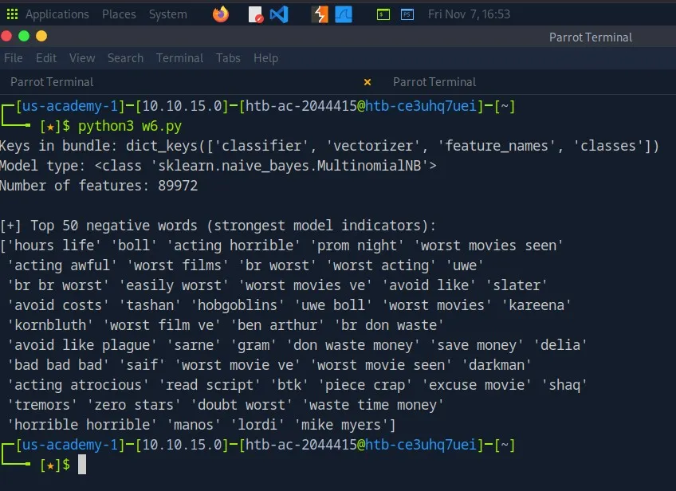
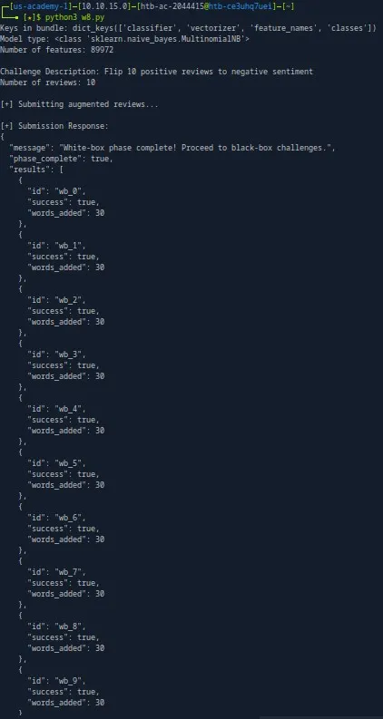
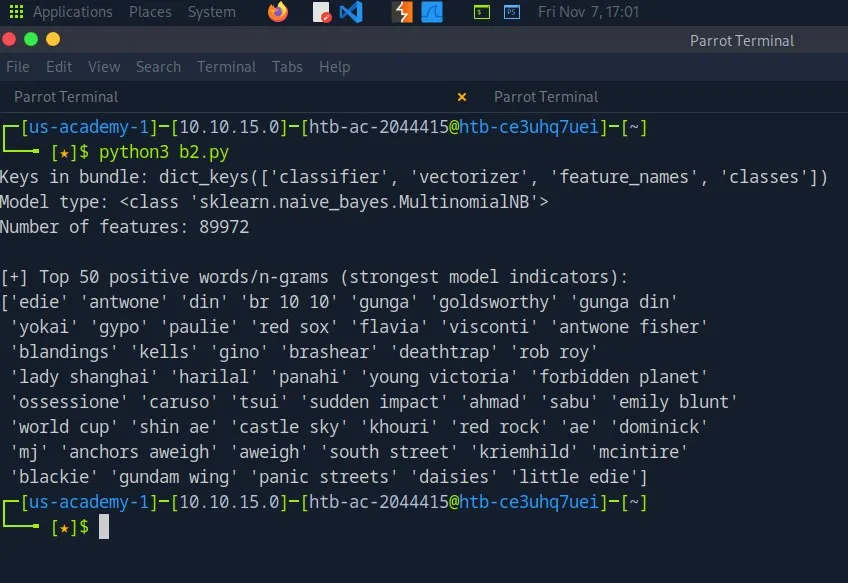
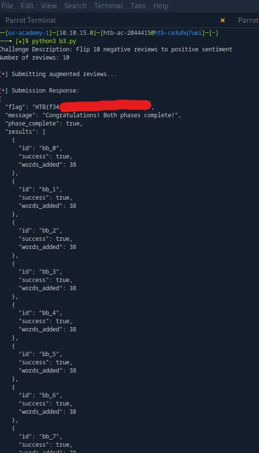
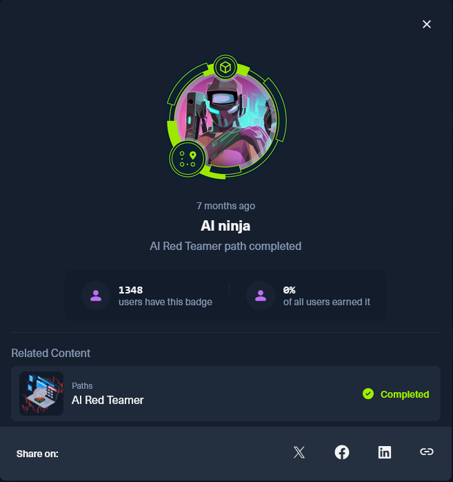

---
layout:
  width: default
  title:
    visible: true
  description:
    visible: true
  tableOfContents:
    visible: true
  outline:
    visible: true
  pagination:
    visible: true
  metadata:
    visible: true
  tags:
    visible: true
  actions:
    visible: false
---

# HTB AI Evasion - Foundations Skills Assessment: Feature Obfuscation Attack

## Background

This module introduces **AI evasion attacks**, where an attacker manipulates a model’s input at inference time to influence its prediction without changing the model itself. The focus is on the **GoodWords attack**, which adds carefully selected benign tokens to shift the output of **Naive Bayes classifiers**. The module finishes with a two-phase skills assessment where I apply these techniques against two classifiers to force intentional misclassifications.

<table data-card-size="large" data-view="cards"><thead><tr><th></th><th data-hidden data-card-cover data-type="image">Cover image</th><th data-hidden data-card-target data-type="content-ref"></th></tr></thead><tbody><tr><td>Check Out my Medium Article</td><td data-object-fit="contain"><a href="../../.gitbook/assets/Screenshot 2026-09-04 230407.jpg">Screenshot 2026-09-04 230407.jpg</a></td><td><a href="https://medium.com/@connor.sorenson2002/htb-ai-evasion-foundations-skills-assessment-feature-obfuscation-attack-bc70e53b03e4">https://medium.com/@connor.sorenson2002/htb-ai-evasion-foundations-skills-assessment-feature-obfuscation-attack-bc70e53b03e4</a></td></tr><tr><td>Python Solution on my Github </td><td data-object-fit="contain"><a href="../../.gitbook/assets/https___dev-to-uploads.s3.amazonaws.com_uploads_articles_sto9g2z6whq2mp7huhqf.webp">https___dev-to-uploads.s3.amazonaws.com_uploads_articles_sto9g2z6whq2mp7huhqf.webp</a></td><td><a href="https://github.com/connorSorenson/naivebayes_exploit">https://github.com/connorSorenson/naivebayes_exploit</a></td></tr></tbody></table>

## Understanding the Problem

Goal - implement a GoodWords attack on the multinomial Naive Bayes classifier.

Context: There are two models, a whitebox and a blackbox model.

### Whitebox

The whitebox model has two main API endpoints. It accepts a GET request to its `/challenge/whitebox api` and returns a JSON object of challenge data. The data is positive movie reviews. We must augment these reviews by appending up to 30 negatively weighted words to trick the classifier. We use the `/submit/whitebox` API to submit our challenge response.

### Blackbox

The blackbox model has two main API endpoints also. It accepts a GET request to its `/challenge/blackbox` API and returns a JSON object of challenge data. The data is negative movie reviews. We must perturb these reviews by appending up to 30 positively weighted words to trick the classifier. We use the `/submit/blackbox` API to submit our challenge response. It also has a third API endpoint, `/predict`, which allows us to **infer the model's positive token weights**. It **allows** us to query words to discover which have strongly positive weights. However, rather than enumerating candidate words through the Blackbox `/predict` endpoint, I decided to use the downloadable Whitebox model as a surrogate and test whether its strongest positive features would transfer to the Blackbox classifier.

## Whitebox - Solving the Negative Weights

There is a third Whitebox endpoint, `/model/download`, which gives us white-box access to the model and allows us to determine which features have the strongest class associations. By interacting with the model, we can build a list of features or "words" strongly associated with the positive and negative classes.

I used **Python** and approached the solution with one primary strategy: obtain a wordlist for the task, then use that wordlist to build the solution phrases.

Begin by installing **scikit-learn, a Python library** which allows us to build and query the model. Then download the model and query for a list of the most negative words. (Obviously change the BASE\_URL to your HTB IP address and port)

```python
pip install scikit-learn
```

```python
import os, requests, pickle  
import numpy as np  
  
np.random.seed(1337)  # For reproducibility  
BASE_URL = os.getenv("BASE_URL", "http://94.237.57.199:58402")  
  
def load_model():  
    """Download and load the model bundle"""  
    # Download model  
    r = requests.get(f"{BASE_URL}/model/download")  
    r.raise_for_status()  
    with open("model.pkl", "wb") as f:  
        f.write(r.content)  
  
    # Load bundle  
    with open("model.pkl", "rb") as f:  
        bundle = pickle.load(f)  
    return bundle  
  
# 1. Load the model bundle  
bundle = load_model()  
if bundle:  
    print(f"Keys in bundle: {bundle.keys()}")  
    print(f"Model type: {type(bundle['classifier'])}")  
    print(f"Number of features: {len(bundle['feature_names'])}\n")  
else:  
    print("[!] Model not loaded")  
    exit(1)  
  
# 2. Extract classifier and features  
clf = bundle['classifier']  
feature_names = np.array(bundle['feature_names'])  
classes = list(bundle['classes'])  
  
# 3. Identify negative and positive class indices  
neg_index = classes.index('negative')  
pos_index = classes.index('positive')  
  
# 4. Compute difference in log-probabilities  
neg_log_probs = clf.feature_log_prob_[neg_index]  
pos_log_probs = clf.feature_log_prob_[pos_index]  
neg_score = neg_log_probs - pos_log_probs  
  
# 5. Extract top 50 negative words  
top_negative_words = feature_names[np.argsort(neg_score)[::-1]][:50]  
  
print("[+] Top 50 negative words (strongest model indicators):")  
print(top_negative_words)
```

The output of this program shows the **50 features most strongly associated with the negative class**.



Then we use this list to build our responses to the whitebox challenges. We essentially query the API `/challenge/whitebox` for the challenges to build an augmented response consisting of each challenge review plus up to 30 words from the negative-feature list. Then submit our solutions to the `/submit/whitebox` API.

I could've incorporated the API response dynamically into my program, but it was easier to just hardcode the list of words now that I had it.

```python
import os, requests, pickle  
import numpy as np  
import json  
  
np.random.seed(1337)  # For reproducibility  
BASE_URL = os.getenv("BASE_URL", "http://94.237.57.199:58402")  
  
def get_challenge(phase):  
    r = requests.get(f"{BASE_URL}/challenge/{phase}")  
    r.raise_for_status()  
    return r.json()  
  
def submit_solutions(phase, solutions):  
    r = requests.post(f"{BASE_URL}/submit/{phase}", json={"solutions": solutions})  
    r.raise_for_status()  
    return r.json()  
  
def load_model():  
    r = requests.get(f"{BASE_URL}/model/download")  
    with open("model.pkl", "wb") as f:  
        f.write(r.content)  
    with open("model.pkl", "rb") as f:  
        bundle = pickle.load(f)  
    return bundle  
  
# 1. Load the model bundle  
bundle = load_model()  
if bundle:  
    print(f"Keys in bundle: {bundle.keys()}")  
    print(f"Model type: {type(bundle['classifier'])}")  
    print(f"Number of features: {len(bundle['feature_names'])}\n")  
else:  
    print("[!] Model not loaded")  
      
    # 2. Retrieve challenge data  
phase = "whitebox"  
challenge = get_challenge(phase)  
print(f"Challenge Description: {challenge.get('description')}")  
print(f"Number of reviews: {len(challenge['reviews'])}\n")  
  
max_added = challenge.get("max_added_words", 30)  
  
# 2. Top negative words extracted from the model  
negative_words = [  
    'hours life', 'boll', 'acting horrible', 'prom night', 'worst movies seen',  
    'acting awful', 'worst films', 'br worst', 'worst acting', 'uwe',  
    'br br worst', 'easily worst', 'worst movies ve', 'avoid like', 'slater',  
    'avoid costs', 'tashan', 'hobgoblins', 'uwe boll', 'worst movies',  
    'kareena', 'kornbluth', 'worst film ve', 'ben arthur', 'br don waste',  
    'avoid like plague', 'sarne', 'gram', 'don waste money', 'save money',  
    'delia', 'bad bad bad', 'saif', 'worst movie ve', 'worst movie seen',  
    'darkman', 'acting atrocious', 'read script', 'btk', 'piece crap',  
    'excuse movie', 'shaq', 'tremors', 'zero stars', 'doubt worst',  
    'waste time money', 'horrible horrible', 'manos', 'lordi', 'mike myers'  
]  
  
# 3. Build augmented texts using top negative words  
solutions = []  
for review in challenge["reviews"]:  
    rid = review["id"]  
    text = review["text"]  
  
    # Append negative words while respecting max_added_words  
    max_added = challenge.get("max_added_words", 30)  
    added_words = []  
    for token in negative_words:  
        token_words = token.split()  
        if len(added_words) + len(token_words) > max_added:  
            break  
        added_words.extend(token_words)  
  
    augmented_text = f"{text.strip()} {' '.join(added_words)}"  
    solutions.append({"id": rid, "augmented_text": augmented_text})  
  
# 4. Submit the solutions  
print("[+] Submitting augmented reviews...")  
response = submit_solutions(phase, solutions)  
  
# 5. Show results  
print("\n[+] Submission Response:")  
print(json.dumps(response, indent=2))
```

As you can see below the program constructs the reviews with the negative words appended to the end and successfully fools the classifier for each case.



## Blackbox - Solving the Positive Weights

Next we must do the opposite. Flip a negative review to be positive. The Blackbox, however, doesn’t give us access to download and interact with the model to build a list of positive weighted words. So I decided to use the model I downloaded from the Whitebox to build a positive feature list rather than iterating through candidate words using the Blackbox `/predict` API, if the weights are consistent across the two models then the wordlist should still work.

I tweaked the original code from earlier to look for **positively associated features**.

```python
import os, requests, pickle  
import numpy as np  
  
np.random.seed(1337)  # For reproducibility  
BASE_URL = os.getenv("BASE_URL", "http://94.237.57.199:58402")  
  
def load_model():  
    """Download and load the model bundle"""  
    r = requests.get(f"{BASE_URL}/model/download")  
    r.raise_for_status()  
    with open("model.pkl", "wb") as f:  
        f.write(r.content)  
  
    with open("model.pkl", "rb") as f:  
        bundle = pickle.load(f)  
    return bundle  
  
  
# =======================  
# Model Loading & Analysis  
# =======================  
  
# 1. Load the model bundle  
bundle = load_model()  
if bundle:  
    print(f"Keys in bundle: {bundle.keys()}")  
    print(f"Model type: {type(bundle['classifier'])}")  
    print(f"Number of features: {len(bundle['feature_names'])}\n")  
else:  
    print("[!] Model not loaded")  
    exit(1)  
  
# 2. Extract classifier and features  
clf = bundle['classifier']  
feature_names = np.array(bundle['feature_names'])  
classes = list(bundle['classes'])  
  
# 3. Identify class indices  
neg_index = classes.index('negative')  
pos_index = classes.index('positive')  
  
# 4. Compute difference in log-probabilities: positive - negative  
pos_log_probs = clf.feature_log_prob_[pos_index]  
neg_log_probs = clf.feature_log_prob_[neg_index]  
pos_score = pos_log_probs - neg_log_probs  
  
# 5. Extract top 50 positive words/n-grams  
top_positive_words = feature_names[np.argsort(pos_score)[::-1]][:50]  
  
print("[+] Top 50 positive words/n-grams (strongest model indicators):")  
print(top_positive_words)
```

In a Naive Bayes model, the `clf.feature_log_prob_` contains the learned log-probability of each feature appearing in a class. So in this new version of the program ...

```python
# 4. Compute difference in log-probabilities: positive - negative  
pos_log_probs = clf.feature_log_prob_[pos_index]  
neg_log_probs = clf.feature_log_prob_[neg_index]  
pos_score = pos_log_probs - neg_log_probs  
  
# 5. Extract top 50 positive words/n-grams  
top_positive_words = feature_names[np.argsort(pos_score)[::-1]][:50] 
```

It calculates how much more **strongly each feature is associated with the positive class than with the negative class**. It then sorts the scores and extracts the 50 features most strongly associated with the positive class. Note how this is simply the opposite of the whitebox version where it calculates how much more strongly each feature is associated with the negative class than with the positive class. It then sorts the scores, and extracts the 50 most strongly favored in the negative class.

A useful way to think about the subtraction is that it is effectively calculating a **log-likelihood ratio**:

"todo below use the math equation syntax after transitioning to gitbook logP(word∣positive)−logP(word∣negative)

Because logarithms turn division into subtraction, this is equivalent to comparing:

log(P(word∣positive)/P(word∣negative)​)"

We **have now identified** the 50 features most strongly associated with the positive class, which we can use to fool the classifier.



Using this wordlist, we build an almost identical solution **for** the Blackbox.

```python
import os, requests, json  
import numpy as np  
  
np.random.seed(1337)  # For reproducibility  
BASE_URL = os.getenv("BASE_URL", "http://94.237.57.199:35773")  
  
def get_challenge(phase="blackbox"):  
    """Fetch blackbox challenge data"""  
    r = requests.get(f"{BASE_URL}/challenge/{phase}")  
    r.raise_for_status()  
    return r.json()  
  
def predict_text(text):  
    """Query the blackbox model to get prediction probabilities"""  
    r = requests.post(  
        f"{BASE_URL}/predict",  
        headers={"Content-Type": "application/json"},  
        json={"text": text}  
    )  
    r.raise_for_status()  
    return r.json()  
  
def submit_solutions(phase, solutions):  
    """Submit flipped solutions for validation"""  
    r = requests.post(f"{BASE_URL}/submit/{phase}", json={"solutions": solutions})  
    r.raise_for_status()  
    return r.json()  
  
# Top positive words/n-grams from whitebox model  
positive_words = [  
    'edie', 'antwone', 'din', 'br 10 10', 'gunga', 'goldsworthy', 'gunga din',  
    'yokai', 'gypo', 'paulie', 'red sox', 'flavia', 'visconti', 'antwone fisher',  
    'blandings', 'kells', 'gino', 'brashear', 'deathtrap', 'rob roy',  
    'lady shanghai', 'harilal', 'panahi', 'young victoria', 'forbidden planet',  
    'ossessione', 'caruso', 'tsui', 'sudden impact', 'ahmad', 'sabu', 'emily blunt',  
    'world cup', 'shin ae', 'castle sky', 'khouri', 'red rock', 'ae', 'dominick',  
    'mj', 'anchors aweigh', 'aweigh', 'south street', 'kriemhild', 'mcintire',  
    'blackie', 'gundam wing', 'panic streets', 'daisies', 'little edie'  
]  
  
# 1. Retrieve blackbox challenge data  
challenge = get_challenge()  
print(f"Challenge Description: {challenge.get('description')}")  
print(f"Number of reviews: {len(challenge['reviews'])}\n")  
  
max_added = challenge.get("max_added_words", 30)  
  
# 2. Build augmented texts using top positive words  
solutions = []  
for review in challenge["reviews"]:  
    rid = review["id"]  
    text = review["text"]  
  
    # Append positive words until max_added_words reached  
    added_words = []  
    for token in positive_words:  
        token_words = token.split()  
        if len(added_words) + len(token_words) > max_added:  
            break  
        added_words.extend(token_words)  
  
    augmented_text = f"{text.strip()} {' '.join(added_words)}"  
    solutions.append({"id": rid, "augmented_text": augmented_text})  
  
# 3. Submit the solutions  
print("[+] Submitting augmented reviews...")  
response = submit_solutions("blackbox", solutions)  
  
# 4. Show results  
print("\n[+] Submission Response:")  
print(json.dumps(response, indent=2))
```

And after testing the program and combining it with the whitebox portion of code, I was able to successfully fool both classifiers and obtain the flag for the skills assessment.



## Security Takeaway

Overall, this module was pretty enjoyable and I found it to be a good introduction to AI evasion. If you're struggling to see how this concept could apply in another context, consider this example. Say you had an AI model as a part of an email spam filter that would read the contents of emails and determine if they were phishing emails or not. If the model **used** a Naive Bayes classifier and **had** exposed endpoints allowing an adversary to query the model and infer the weights of particular words, they could potentially craft phishing emails that bypass the filter.

If you're interested in learning about more AI red teaming, I highly recommend HTB Academy's AI Red Teamer learning path.


