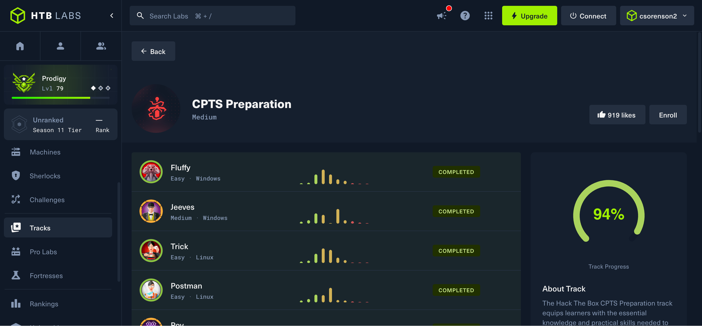
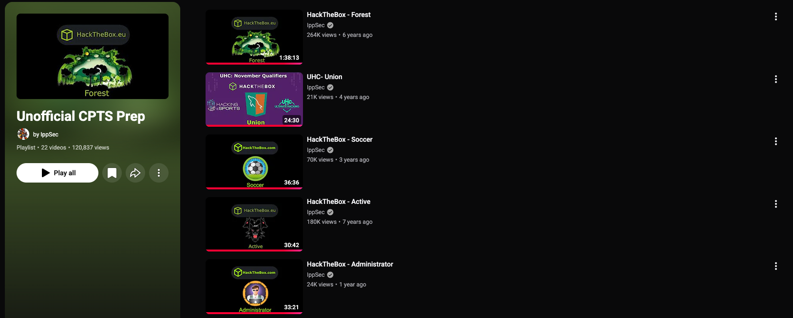

---
layout:
  width: default
  title:
    visible: true
  description:
    visible: true
  tableOfContents:
    visible: true
  outline:
    visible: true
  pagination:
    visible: true
  metadata:
    visible: true
  tags:
    visible: true
  actions:
    visible: false
---

# My 3-Month Study Plan - How I Passed the HTB CPTS on My First Attempt

### The Story

At the beginning of the month, I started one of the toughest exams I have ever taken. Eight grueling days later, I had 12/14 flags, a 200-page report, and an email in my inbox congratulating me on passing the CPTS exam.

In this post, I'll explain exactly how I went from a script kiddie noob who didn't know a thing about pentesting to passing CPTS. I'll include my study timeline, a breakdown of the content you need to master, a sneak peek at important practice boxes, additional study tips, and my reflections after completing the course and exam.

Feel free to check out my bio here \_ if you are interested in my credentials and check out my latest blog posting here \_ to learn more about reversing!

### Learning from Mistakes

Before beginning the CPTS academy path I had relatively little cyber experience. I already held the CCNA, Security+, and GCIH when I began the path in June 2025. Over the following 12 months, I also earned GPEN and GRTP through exam challenge attempts before eventually returning to redo the CPTS training path.

On my first go-around, I didn't take any notes while completing the path. I simply read each module and worked through the box at the end of the section. I went through the path relatively casually and finished around late September 2025. Consequently, I failed to retain a lot of the information. I could recognize techniques when I saw them, but I struggled to recall them or differentiate between similar approaches without going back through the material. At the same time, I was learning pentesting and red teaming while preparing for several SANS certifications. Those exams, however, are much more knowledge-focused, while CPTS is a completely practical exam.

At the beginning of June 2026, I set a goal to finally take CPTS and started seeking advice from coworkers and other successful CPTS holders. Two resources I found especially helpful were https://www.youtube.com/@cyberryan/videos and https://www.youtube.com/watch?v=czGXFB5xnPw

With my long range goal set I now needed to make a plan. Here is where I'm going to layout for you exactly how you can prepare for the exam, and give yourself the best chance to pass. You may be an absolute genius, but I promise you: this exam is extremely difficult. For anyone reading this who disagrees, good for you, I hope one day to reach that level.

### The Plan

This is the study plan I would recommend if I had to prepare for CPTS again from scratch.

#### Step 1: Preparation

* **Obsidian** https://obsidian.md/
  * Was the backbone of my note-taking process. It stores notes as Markdown files, makes it easy to organize everything into folders, supports code blocks and checklists, and can even be synced through GitHub for free. Most importantly, it gave me one place to maintain both my technical notes and my pentesting methodology.
* Clipping Tools
  * Markdownload https://addons.mozilla.org/en-US/firefox/addon/markdownload/
    * Saved my life. It lets you copy formatted content from webpages directly into Markdown, which made moving Academy content, commands, and code blocks into my notes significantly faster.
  * **Greenshot** https://getgreenshot.org/
    * A lightweight screenshot tool that makes it easy to crop images, draw boxes, add labels or comments, and blur credentials.
* **VirtualBox** https://www.virtualbox.org/ with **Kali** https://www.kali.org/get-kali/ - I used a Kali Linux VM in VirtualBox rather than relying entirely on Pwnbox. Kali comes preloaded with most of the tools you'll need, while still giving you a persistent environment you can customize throughout your preparation. Connect it to HTB by downloading your `.ovpn` file.
* SysReptor https://docs.sysreptor.com/setup/installation
  * A must-have, in my opinion. It makes building professional PDF reports significantly easier and includes templates designed specifically for HTB exams. I recommend getting comfortable with it before your exam instead of learning your reporting workflow while the clock is running.

#### Step 2: The path

* Notes
  * Take notes for **EVERY SINGLE COMMAND** on every single section. Your notes should contain more than syntax. Record what the command does, why you're running it, what you're looking for in the output, and what your next step should be based on the result.
* Methodology
  * This is where you build your methodology: a checklist of actions you can fall back on whenever you feel lost. It should give you a clear process for web, host, and Active Directory enumeration, along with privilege escalation. Don't build a giant collection of man pages. Build a decision-making tool.
* Path
  * embed iframe of https://academy.hackthebox.com/preview/certifications/htb-certified-penetration-testing-specialist/
* Important Modules
  * I originally planned to list the five or ten CPTS modules I thought deserved the most attention. After looking back through the path, I honestly couldn't do it. Roughly 24 of the 28 modules contain material I would consider critical.

#### Step 3: Boxes

In my opinion, someone who is perfect on the learning path will still fail the exam in the majority of cases. I genuinely believe one of the biggest reasons I passed was that I completed roughly 95% of both the _Official CPTS Preparation Track_ and _IppSec's Unofficial CPTS Prep_ playlist.

* CPTS Track

* IppSec Track https://www.youtube.com/playlist?list=PLidcsTyj9JXItWpbRtTg6aDEj10\_F17x5

* Approach to Boxes
  * When working through boxes, focus on practicing your **methodology**, not just getting root. Try things. Fail. Go back through your checklist. Use your own notes before immediately turning to Google or a writeup.
  * Every few boxes, practice documenting your work in Obsidian as if you were working the exam. This prepares you for AEN and eventually for building your report in SysReptor.
  * Set a timer when you begin and track how long each box takes. Give yourself a minimum amount of time before allowing yourself to use a writeup. The exact number of hours is up to you, but don't let “being stuck” for 20 minutes become an excuse to immediately look up the answer. I recommend using https://0xdf.gitlab.io/ writeups.
  * If a box introduces a technique that wasn't taught in the course, **write it down**. Those little additions are the difference between passing and failing ;)

#### Step 4: AEN

* Approach to AEN
  * If you've read anything about CPTS preparation, you've probably heard some variation of **“do AEN blind.”** I generally agree, but I think the real value of AEN is practicing how to document your work while chaining multiple findings together to achieve an objective. If you have to follow the AEN module step-by-step to finish it, or you still don't understand what you were missing after reviewing the solution, I would be cautious about immediately scheduling the exam. Treat it similarly to the practice boxes. Give yourself several hours to work through a problem before going back to the module. If you eventually need help, that's fine but make sure you understand _why_ you were stuck.
* SysReptor Practice
  * You should have already set up SysReptor by this point, but if you haven't, it's not the end of the world. I HIGHLY recommend watching CyberRyan's demonstration as he walks through everything you need to practice to be able to use it for the exam reporting. https://www.youtube.com/watch?v=cQFXuMPv2KE

#### Step 5: Exam

* Time Management
  * Plan as if you're going to need the entire exam window. I would budget for at least eight hours of focused work per day rather than assuming you'll finish early.
  * **I didn't get any flags until day 3**. Once I finally got the first one, the others started coming at roughly two per day. Everything they say about flags 1 and 8 are true. They were difficult because they required a long chain of correct decisions.
* Sticking to Methodology
  * You will not remember everything you need to try. **Let your methodology remember for you.**
* Breakout of SysReptor & Logging
  * Log every command, whether with tmux logging, or copying and pasting commands and their output into Obsidian.
  * Explain in between your logs what you are trying and why. Keep a separate note for credentials, and keep a separate note for each device you laterally move to.

### Post-Exam Reflections

* What I've Learned
  * The difference between my skills before and after CPTS is night and day. I came out of the process leaps and bounds better as an operator. Of all the training and certifications I have completed, this one was the most difficult for me, but also the most rewarding.
* Mental Health
  * Remember to pace yourself. Keep up with the rest of your responsibilities and take breaks when you need them. CPTS preparation is a marathon, not a sprint. Consistent progress over several months will beat random bursts of 12-hour study sessions every time.
* What's Next?
  * Right now I'm eyeing CAPE, CRTO, or MalDev Academy. I haven't decided which one is next yet ... but this is just the beginning of my journey.
