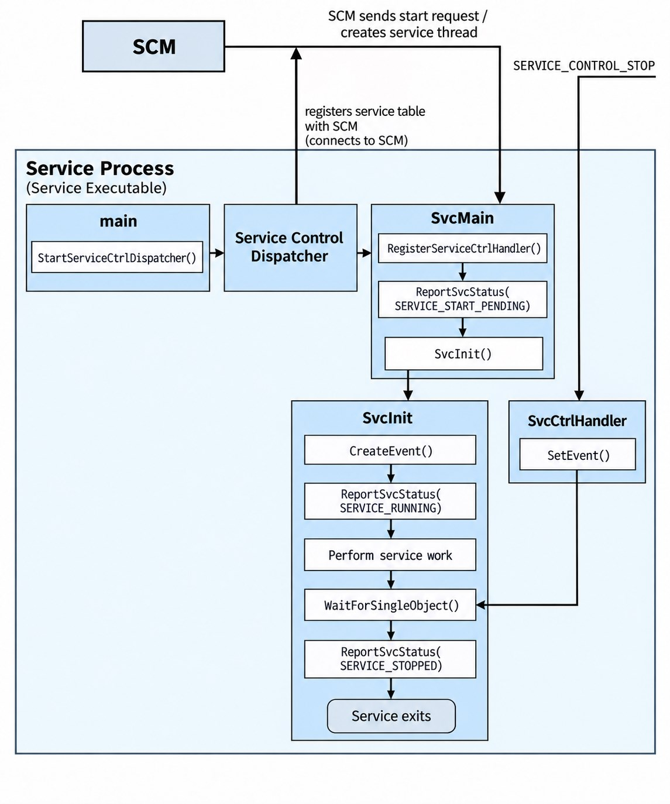
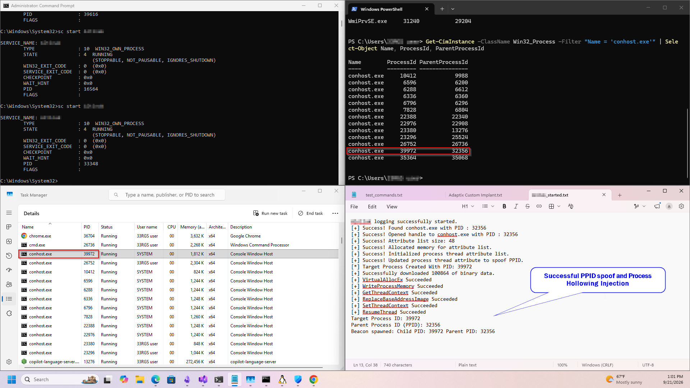
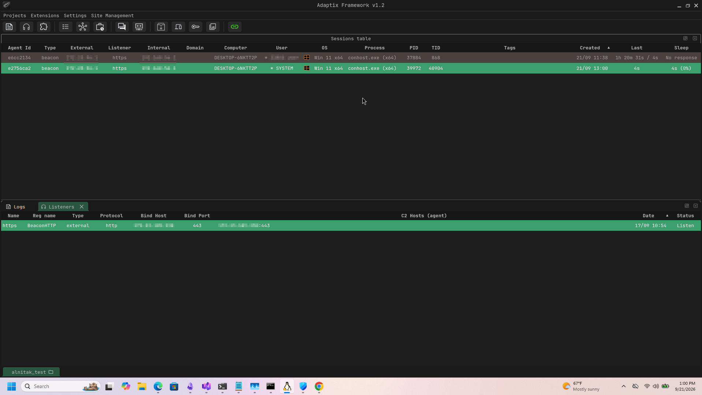
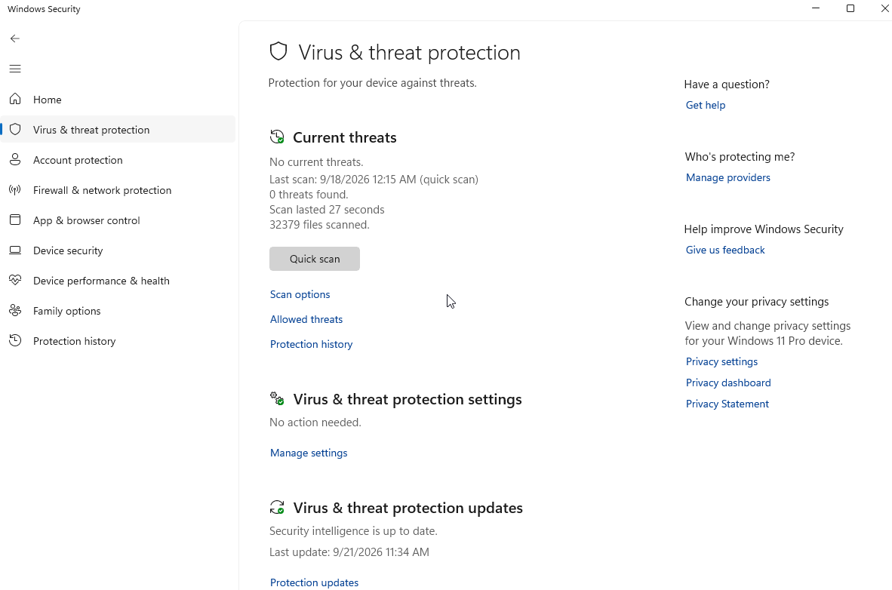
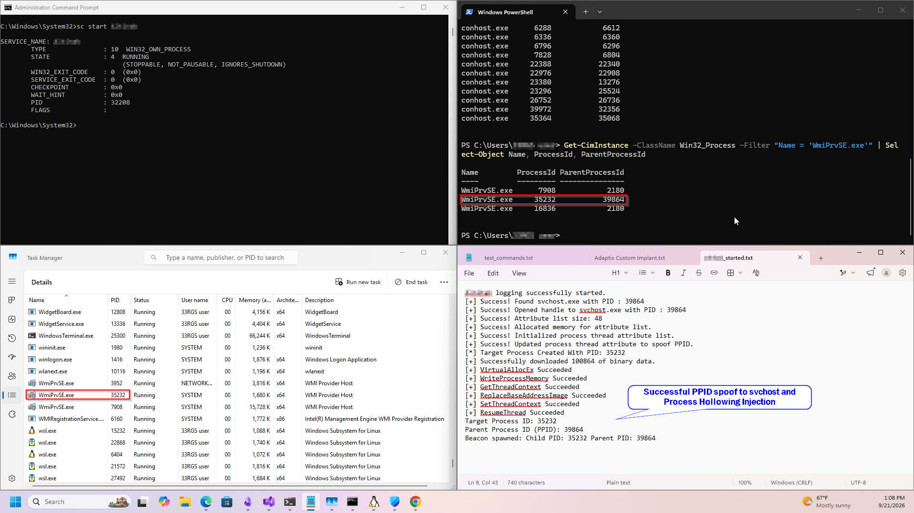
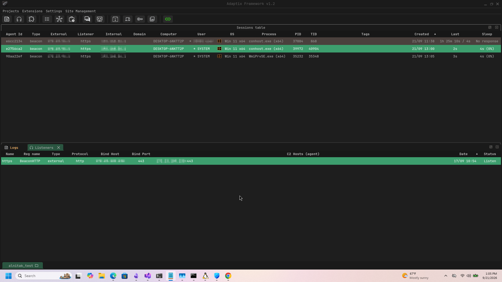

# Turning a C2 stager into a Windows Service Executable

You’ve successfully acquired local admin credentials and identified a workstation sitting perfectly between two segmented networks. The path for lateral movement is clear. You have a custom stager ready, hosted on a temporary python web server, just waiting to drop a C2 beacon onto the target. But the moment that untrusted EXE hits the disk and executes, the clock starts ticking. In a standard user session, it may trigger SmartScreen reputation warnings.

Say the stager was decently [written](https://www.elastic.co/security-labs/threat-command/dissecting-remcos-rat-part-one). It use a combination of anti-reversing/analysis techniques and obfuscated TTPs. For example, a stager that requests an encrypted payload (`Adaptix agent` / `Cobalt beacon`) over a trusted TLS cert, one that spawns a suspended child process with the [ppid spoofed](https://trustedsec.com/blog/ppid-spoofing-its-really-this-easy-to-fake-your-parent) to a benign parent-child relationship, and performs [process hollowing](https://www.picussecurity.com/resource/blog/t1055-012-process-hollowing) to inject the payload before calling `ResumeThread`.

It’s better than default remote process injection using `CreateRemoteThread`, and Windows Defender probably won’t catch it, but a modern EDR hooking ntdll.dll or a well-tuned Sysmon configuration will spot the anomaly. The reality is simple: dropping an untrusted executable to disk, running it, and deleting it rarely flies unnoticed anymore. But what if it wasn't just a standard user-space executable? What if it was a service?

## Service Executables

Introducing [Windows Service](https://learn.microsoft.com/en-us/windows/win32/services/about-services) executables. By design, services offer unique architectural advantages over traditional binaries:

* **System Context Execution:** Can natively run under privileged service accounts such as `LocalSystem`, `LocalService`, or `NetworkService`.
* **Executed by Services.exe:** Executed by the Windows OS itself through the Service Control Manager (SCM)
* **Session 0 Isolation:** Services are executed in a completely non-interactive environment (Session 0). Because there is no GUI element, execution remains invisible to the end user.

By turning a stager into a functional Windows service, we can fundamentally alter the attack surface. Instead of pulling the file down via browser originated HTTP(S) we deliver it via an encrypted and signed SMB session where [SmartScreen](https://learn.microsoft.com/en-us/windows/security/operating-system-security/virus-and-threat-protection/microsoft-defender-smartscreen/) workflows don't occur.

Furthermore, we can stage the binary in a legitimate directory like `C:\Windows\System32` or `C:\Program Files`. While tier-one enterprise EDR solutions monitor these paths, we can exploit blind spots in some lightweight monitoring agents.

<table data-search="false"><thead><tr><th>Endpoint Product w/ default config</th><th width="174" align="center">C:\Windows\System32</th><th width="148" align="center">C:\Program Files</th><th align="center">C:\Program Files (x86)</th></tr></thead><tbody><tr><td>CrowdStrike Falcon Insight XDR</td><td align="center">x</td><td align="center">x</td><td align="center">x</td></tr><tr><td>SentinelOne Singularity Complete / ActiveEDR</td><td align="center">x</td><td align="center">x</td><td align="center">x</td></tr><tr><td>Palo Alto Cortex XDR Pro</td><td align="center">x</td><td align="center">x</td><td align="center">x</td></tr><tr><td>Elastic Defend</td><td align="center">x</td><td align="center">x</td><td align="center">x</td></tr><tr><td>Microsoft Defender for Endpoint</td><td align="center">x</td><td align="center">x</td><td align="center">x</td></tr><tr><td>Trellix ENS / EDR</td><td align="center">x</td><td align="center"></td><td align="center"></td></tr><tr><td>Wazuh Windows FIM</td><td align="center"></td><td align="center"></td><td align="center"></td></tr><tr><td>OSSEC Syscheck</td><td align="center"></td><td align="center"></td><td align="center"></td></tr></tbody></table>

## Why Service Executables Shift the Odds

Once configured by an administrator, the service executable is managed directly through the SCM. Relying on a service architecture provides advantages over launching standard binaries during lateral movement:

* **Blending with System Baseline Telemetry:** Standard executables spawning from `C:\Users\x\Downloads` or `C:\Users\x\AppData` stick out immediately. A service binary executing from `C:\Windows\System32` under the umbrella of `services.exe` matches the standard behavioral baseline of a booting windows environment.
* **By-passing User-Land Prompts:** Because services bypass the interactive user session entirely, they inherently neutralize security mechanisms designed to catch user-driven execution, such as `SmartScreen` alerts or `User Account Control` (UAC) pop-ups.
* **Potential Persistence Realized Natively:** Standard stagers run, inject, and are frequently deleted or killed, creating a short, high-risk operational window. A service provides a native mechanism for persistence when configured for automatic startup. If the host reboots or the connection drops, the SCM handles recovery and restart logic naturally, removing the need to run separate persistence scripts that generate additional log noise.

## The Structure of a Windows Service Executable

To begin, we first need to understand a little about the Service Control Manager (SCM). The SCM is responsible for starting, stopping, managing, and monitoring Windows services.

When the SCM launches a service process, it expects the process to connect to it by calling `StartServiceCtrlDispatcher`. Conceptually, this call tells the SCM, "Hi, I'm a service process, and I'm ready to receive service requests." The service process should make this call as soon as possible after startup.

If we were to configure a regular stager as the service executable without implementing the required service interface, the process would not call `StartServiceCtrlDispatcher`. The SCM would therefore be unable to establish the expected service connection, and the service would eventually fail to start, commonly producing `ERROR_SERVICE_REQUEST_TIMEOUT` (1053). If the stager had no waiting or sleeping mechanism intended to delay its execution, its payload might still execute before the service startup fails; however, the failed service start would be abnormal and potentially noticeable.

To familiarize myself with writing Windows service executables, I relied heavily on Microsoft's Windows Services documentation: [Using Services](https://learn.microsoft.com/en-us/windows/win32/services/using-services)

Microsoft also provides a complete working service example here: [The Complete Service Sample](https://learn.microsoft.com/en-us/windows/win32/services/svc-cpp)

It is important to note that functions such as `SvcMain`, `SvcInit`, `SvcCtrlHandler`, and `ReportSvcStatus` are names used by Microsoft's example implementation. They are not mandatory function names defined by Windows. The important part is the role each function performs and how it interacts with the Windows service APIs.

### Main

For a typical C service program, `main` is where our application code begins executing after the C runtime has performed its initialization. Other mechanisms, such as TLS callbacks, can execute before control reaches `main`. The primary job of `main` in a service process is to define a `SERVICE_TABLE_ENTRY` dispatch table and call `StartServiceCtrlDispatcher`.

[Writing a Service Program's Main Function](https://learn.microsoft.com/en-us/windows/win32/services/writing-a-service-program-s-main-function)

The dispatch table associates each service hosted by the process with its corresponding `ServiceMain` function. `StartServiceCtrlDispatcher` then connects the calling thread to the SCM and turns it into the service control dispatcher thread. The dispatcher waits for requests from the SCM. When the SCM requests that a service start, the dispatcher creates a new thread that executes the corresponding `ServiceMain` function specified in the dispatch table.

In simplified form:

`main` → `StartServiceCtrlDispatcher` → SCM connection → dispatcher → `SvcMain`

One important distinction is that `main` does **not** directly call `SvcMain`. Instead, `main` provides the SCM with the dispatch table, and the service control dispatcher later invokes the appropriate `SvcMain` function when the service receives a start request.

```c
int main(int argc, char* argv[])
{


	SERVICE_TABLE_ENTRY DispatchTable[] =
	{
		{ SVCNAME, (LPSERVICE_MAIN_FUNCTION)SvcMain },
		{ NULL, NULL }
	};

	// This call returns when the service has stopped. 
	// The process should simply terminate when the call returns.

	if (!StartServiceCtrlDispatcher(DispatchTable))
	{
		return GetLastError();
	}
}
```

### SvcMain

`SvcMain` acts as the entry point for the individual service. Once the SCM requests that the service start, the service control dispatcher creates a thread that executes `SvcMain`.

The Microsoft sample performs three important operations here:

`RegisterServiceCtrlHandler` → `ReportSvcStatus` → `SvcInit`

First, `RegisterServiceCtrlHandler` registers the service's control-handler function, named `SvcCtrlHandler` in Microsoft's example. This function returns a service status handle that the program can later use when reporting changes in the service's state to the SCM.

Next, the service reports that it is currently starting by setting its status to `SERVICE_START_PENDING`.

Finally, `SvcMain` calls `SvcInit`, which performs the service-specific initialization and begins the actual work performed by the service.

[Writing a ServiceMain Function](https://learn.microsoft.com/en-us/windows/win32/services/writing-a-servicemain-function)

```c
VOID WINAPI SvcMain(DWORD dwArgc, LPTSTR* lpszArgv)
{
	// Register the handler function for the service

	gSvcStatusHandle = RegisterServiceCtrlHandler(
		SVCNAME,
		SvcCtrlHandler);

	if (!gSvcStatusHandle)
	{
		return;
	}

	// These SERVICE_STATUS members remain as set here

	gSvcStatus.dwServiceType = SERVICE_WIN32_OWN_PROCESS;
	gSvcStatus.dwServiceSpecificExitCode = 0;

	// Report initial status to the SCM

	ReportSvcStatus(SERVICE_START_PENDING, NO_ERROR, 3000);

	// Perform service-specific initialization and work.

	SvcInit(dwArgc, lpszArgv);
}
```

### SvcCtrlHandler

`SvcCtrlHandler` is responsible for processing control codes sent to the service by the SCM.

For example, when the SCM sends `SERVICE_CONTROL_STOP`, the handler can report that the service is entering the `SERVICE_STOP_PENDING` state and signal an event telling the service's main work routine that it should terminate.

The handler should report a new status to the SCM when processing a control request actually changes the service's state. If the service ignores or does not act on a particular control code, there is generally no reason to report a new status.

[Writing a Control Handler Function](https://learn.microsoft.com/en-us/windows/win32/services/writing-a-control-handler-function)

In Microsoft's example, the stop sequence can be simplified as:

`SCM` → `SvcCtrlHandler` → `SERVICE_CONTROL_STOP` → `SetEvent`

That event is the same event on which the service's `SvcInit` function is waiting.

```c
VOID WINAPI SvcCtrlHandler(DWORD dwCtrl)
{
	// Handle the requested control code. 

	switch (dwCtrl)
	{
	case SERVICE_CONTROL_STOP:
		ReportSvcStatus(SERVICE_STOP_PENDING, NO_ERROR, 0);

		// Signal the service to stop.

		SetEvent(ghSvcStopEvent);
		ReportSvcStatus(gSvcStatus.dwCurrentState, NO_ERROR, 0);

		return;

	case SERVICE_CONTROL_INTERROGATE:
		break;

	default:
		break;
	}

}
```

### SvcInit

This is where the juice happens.

In Microsoft's example, `SvcInit` performs the service-specific initialization and contains the work performed by the service. It first creates an event using `CreateEvent`. This event provides a synchronization mechanism that allows the control handler to tell the service when it should stop.

Once initialization has completed successfully, the service reports the `SERVICE_RUNNING` state to the SCM. The service can then perform its actual work while monitoring the stop event. When `SvcCtrlHandler` receives a stop request, it signals this event. `SvcInit` detects the signal, performs any necessary cleanup, reports `SERVICE_STOPPED`, and returns.

A simplified representation is:

`CreateEvent` → `SERVICE_RUNNING` → `Do Work` → `WaitForSingleObject` → `SERVICE_STOPPED`

[Writing a ServiceMain Function](https://learn.microsoft.com/en-us/windows/win32/services/writing-a-servicemain-function)

The `Do Work` portion is where we can place the C2 stager functionality that we actually want the service to perform.

```c
VOID SvcInit(DWORD dwArgc, LPTSTR* lpszArgv)
{
	// TO_DO: Declare and set any required variables.
	//   Be sure to periodically call ReportSvcStatus() with 
	//   SERVICE_START_PENDING. If initialization fails, call
	//   ReportSvcStatus with SERVICE_STOPPED.

	// Create an event. The control handler function, SvcCtrlHandler,
	// signals this event when it receives the stop control code.

	ghSvcStopEvent = CreateEvent(
		NULL,    // default security attributes
		TRUE,    // manual reset event
		FALSE,   // not signaled
		NULL);   // no name

	if (ghSvcStopEvent == NULL)
	{
		ReportSvcStatus(SERVICE_STOPPED, GetLastError(), 0);
		return;
	}

	// Report running status when initialization is complete.

	ReportSvcStatus(SERVICE_RUNNING, NO_ERROR, 0);

	/////////============= DO WORK ==========================================

		//pseudocode
		DWORD parentPid = SpoofParentPid();
		DWORD pid = CreateSuspendedProcess(parentPid);
		ProcessHollowInject(pid);
		
		SvcCtrlHandler(SERVICE_CONTROL_STOP);
	}
	//////=====================================================================
	
	// Main service loop: wait until stop event is signaled by the
	// service control handler. This keeps the service alive until
	// the SCM sends a STOP control.
	while (1)
	{
		DWORD wait = WaitForSingleObject(ghSvcStopEvent, INFINITE);

		if (wait == WAIT_OBJECT_0)
		{
			// Stop event signaled: perform cleanup and exit the loop.

			if (ghSvcStopEvent != NULL)
			{
				CloseHandle(ghSvcStopEvent);
				ghSvcStopEvent = NULL;
			}

			ReportSvcStatus(SERVICE_STOPPED, NO_ERROR, 0);
			break;
		}
		else
		{
			// Unexpected result; report stopped with error and break.
			ReportSvcStatus(SERVICE_STOPPED, GetLastError(), 0);
			break;
		}
	}

	return;

}
```

### Putting it Together



## Demo

After rewriting a custom stager as a service executable, I performed some testing on a `Windows 11 VM` using `AdaptixC2`.

### Experiment 1

Injection into `conhost.exe` with existing `conhost.exe` set as parent

Final Result: `services.exe` -> `serviceExecutable.exe (injects into 2nd conhost)`&#x20;

&#x20;                       `conhost.exe` -> `conhost.exe (C2)`

As you can see below, our stager wrote a successful result to the log file and we got a callback in Adaptix.





**Windows Defender** did not flag any of our activity when performing the injection into `conhost`



### Experiment 2

Injection into `WmiPrvSE.exe` with existing `svchost.exe` as parent

Final Result: `services.exe` -> `serviceExecutable.exe (injects into WmiPrvSE)`&#x20;

&#x20;                       `svchost.exe` -> `WmiPrvSE.exe (C2)`





**Windows Defender** did however flag our activity when performing the injection into `WmiPrvSE`.

## Conclusion

Converting a traditional C2 stager into a Windows service executable demonstrates how much execution context can influence both reliability and detection. By properly integrating with the Service Control Manager, the stager can operate within the normal Windows service lifecycle while still performing its intended workload. However, the testing also shows that running as a service does not make malicious behavior inherently stealthy; endpoint defenses can still identify suspicious process creation, parent-child relationships, memory modification, and injection activity. Ultimately, understanding how Windows services are structured provides value not only for offensive tooling, but also for recognizing the telemetry and behaviors defenders can use to detect service-based tradecraft.
