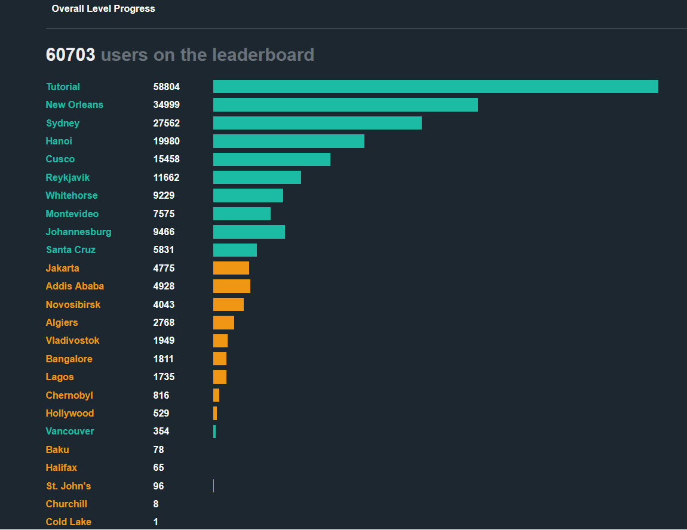

# Microcorruption

Welcome to my writeup series for the [Microcorruption Embedded Security CTF](https://microcorruption.com/).

Microcorruption is an embedded security CTF centered around reverse engineering and exploiting the firmware of fictional **Lockitall electronic locks**. Rather than attacking traditional web applications or network services, the challenges place you inside a debugger where you analyze **MSP430 assembly**, inspect memory, trace program execution, and eventually develop exploits to unlock each device.

This series documents my approach to each challenge, including the reasoning behind the solution, relevant assembly concepts, and the exploitation techniques used along the way.

### About the CTF

The premise of Microcorruption is simple: each challenge represents a secure warehouse protected by a Lockitall electronic lock. Your objective is to identify a vulnerability in the lock's firmware and exploit it to unlock the door.

The early challenges introduce fundamental reverse-engineering concepts such as:

* Reading and navigating MSP430 assembly
* Understanding registers and memory
* Following program control flow
* Identifying function calls and arguments
* Inspecting values stored in memory
* Recognizing hardcoded credentials

As the challenges progress, the solutions begin requiring more traditional binary-exploitation techniques, including:

* Stack analysis
* Buffer overflows
* Manipulating program control flow
* Understanding calling conventions
* Constructing malicious input
* Developing exploit payloads

This gradual progression is one of the things I enjoy most about the CTF. The earlier levels provide enough exposure to the architecture and debugger to prepare you for the more advanced exploitation challenges later on.

### How do I know I'm ready to try this CTF? Is it beginner friendly?

Yes, this CTF in my opinion has challenges for people of all levels. For those unfamiliar with assembly, control flow, or calling conventions, I would first suggest working on those fundamentals. An excellent source I frequently refer back to is from the University of Virginia. [University of Virginia x86 Assembly Guide](https://www.cs.virginia.edu/~evans/cs216/guides/x86.html)

While there isn't an exact 1 to 1 match between the details of an x86 and an MSP430 processor, the foundational concepts are universal and apply to both in the majority of cases. Anyone with general foundational skills in these concepts can attempt this CTF and use the provided resources to build their understanding of the MSP430 processor and the LockitPro hardware and software interfaces.

### Current Progress

I'm currently working through documenting my solves for the following challenges shown below. The blue levels have been completed and the orange ones are the next recommended challenges.

<figure><figcaption></figcaption></figure>

The site also features a leaderboard where you can see how many others where able to solve each challenge. I look forward to continuing to solve the remaining levels and making the writeups!

<figure><figcaption></figcaption></figure>

### Challenge Writeups

**New Orleans** Microcorruption challenge writeup.


[new-orleans.md](new-orleans.md)


... more coming soon
