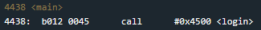
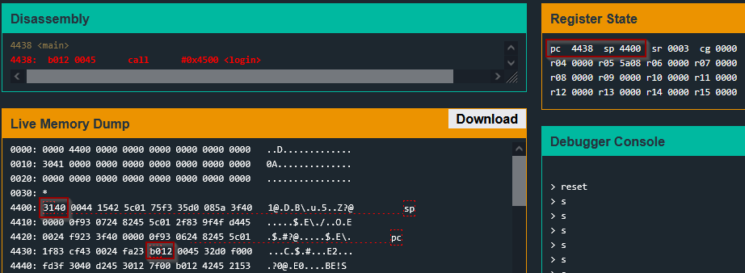
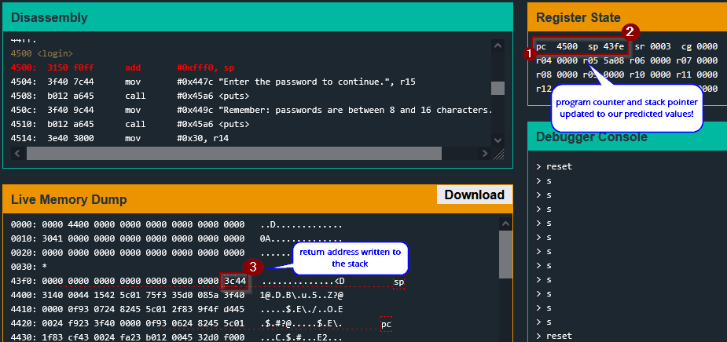
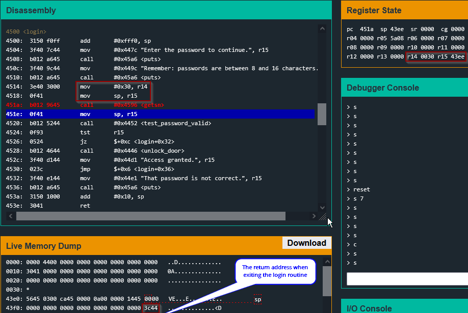
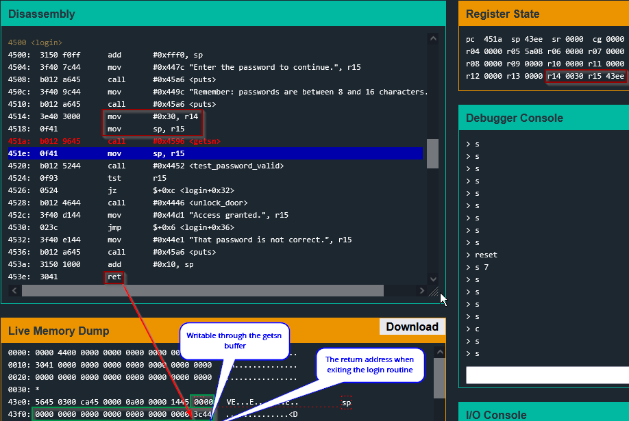
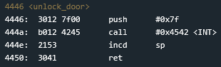
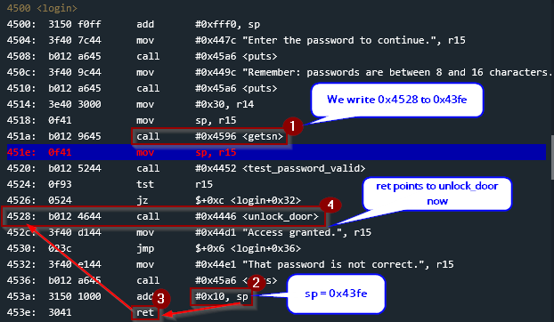
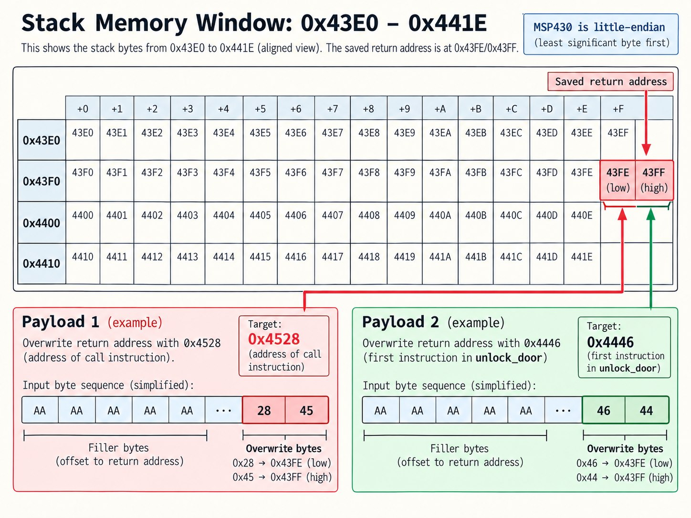
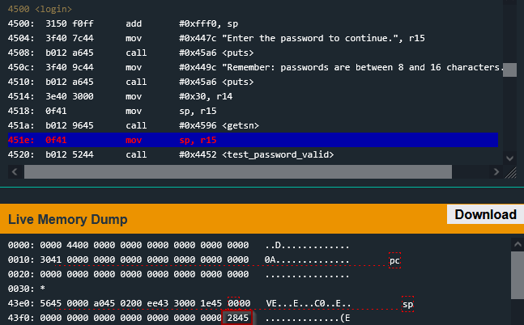
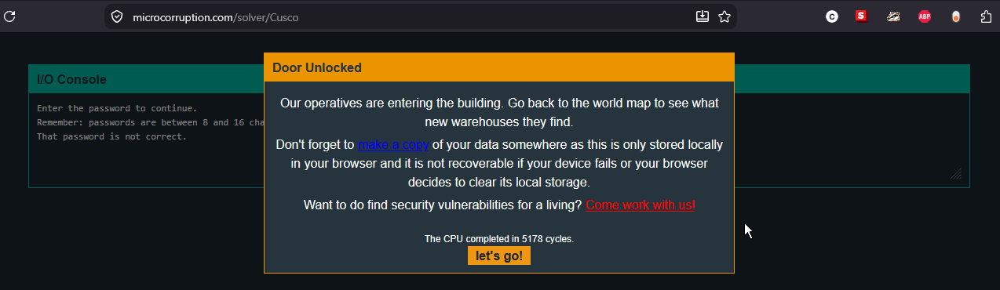

# Cusco

## Calling Conventions

A **calling convention** defines how functions interact with one another, including how arguments are passed, which registers a function must preserve, how the stack is managed, and how execution returns to the caller. On the MSP430, `r1` is the stack pointer (`sp`), and the stack grows toward lower memory addresses. Registers `r4`–`r10` are generally callee-saved, meaning a function must restore them if it modifies them, while `r11`–`r15` are caller-saved and may be changed by a called function.

The `call` instruction also performs part of the stack management automatically. When a function is called, the processor pushes the address of the instruction immediately following the `call` onto the stack and then transfers execution to the target function. When the function later executes `ret`, that saved address is popped from the stack and loaded into the program counter, returning execution to the caller.

## Analyzing `Main` & `login`

To begin our analysis of this challenge, we see that the `main` routine simply calls `login`.

To demonstrate an example of the calling convention I discussed earlier, let's debug the call to `login` at `0x4438` and examine the stack.

If we set a breakpoint at `0x4438`, we can debug the state of the registers before the call to `login`and also inspect the live memory dump. In the screenshot above we can look at the program counter to confirm its value`0x4438`. This is before the `call`instruction has been executed. If we look at the stack pointer we can see that it is currently set to `0x4400`.

If we inspect the memory at this location we can see it currently holds the value `0x4031`. From the previous calling convention explanation, we know that when the `call` instruction is executed, there is an implicit `push`. The stack pointer will be decremented to `0x43fe` and the address of the next instruction after the call, `0x443c`, will be pushed onto the stack.

If I step into the `login` routine, thereby also executing the call at `0x4438`, we will see the program counter move to `0x4500`, the stack pointer move to `0x43fe` and `0x443c` be written to the stack. Let's check ...

## Overwriting Return Address

The important lesson this challenge demonstrates is that if we can manipulate the memory where a return address is stored, we can redirect code execution when the `ret` instruction pops the saved return address from the stack and loads it into the program counter.

In the previous challenge, we observed that the call to `getsn` used a maximum buffer size larger than needed which allowed overwriting a location used in a `cmp`. In this challenge, `login` doesn't have any `cmp` instructions for us to overwrite operands.

However, the oversized buffer is interesting. At `0x451a`, the call to `getsn` has a buffer size of `30h` == 48, and a write address of `0x43ee`.

This means we can write anywhere from `0x43ee` to `0x441d`. The return address for the `login` call at `0x43fe` falls in this range!

Note for img: the green square indicates writable memory addresses

### Simple Payload

Ok, so we can overwrite the return address but what do we write there? In future challenges we will have to build custom payloads consisting of valid opcodes, arithmetic operations to write problematic byte values like `0x00`, and return addresses.

This challenge is much simpler though. We know there exists a function, `unlock_door`, which invokes the `INT` routine with `0x7f` to unlock the door.

If we can make our return address the address of this function, we can skip over all the logic of the program and instantly solve the level. We can simply insert the location of an instruction which calls the `unlock_door` routine (`0x4528`), or insert the address of the first instruction in the routine (`0x4446`).

Since we know the buffer begins at `0x43ee` and we know we need to place the address at `0x43fe` we know we need to pad our payload with `0x43fe` -`0x43ee` = `10h` or `0x10` (16) bytes of padding. We also, as always, need to ensure we are using the correct endianness.

Payload 1: 00 00 00 00 00 00 00 00 00 00 00 00 00 00 00 00 28 45 Payload 2: 00 00 00 00 00 00 00 00 00 00 00 00 00 00 00 00 46 44

Below, I used the address of the `call` instruction as the overwritten return address. In the memory window, we can see that the value at `0x43fe` is no longer `0x443c`, but our supplied value of `0x4528`.

Because this saved address is consumed when `login` returns, we continue stepping until the function exits. The program will print the `"That password is not correct."` message before the overwritten return address redirects execution to `0x4528`, eventually unlocking the door.

## Security Takeaway

This challenge demonstrates why memory safety is critical when handling user-controlled input. Because `getsn` is allowed to write beyond the intended local buffer, an attacker can overwrite the saved return address on the stack and redirect program execution when the function returns. In a real application, strict bounds checking, memory-safe APIs, and modern exploit mitigations help prevent this type of stack-based control-flow hijacking
