---
layout:
  width: default
  title:
    visible: true
  description:
    visible: false
  tableOfContents:
    visible: true
  outline:
    visible: true
  pagination:
    visible: true
  metadata:
    visible: true
  tags:
    visible: true
  actions:
    visible: false
---

# Hanoi

In the previous two challenges we were able to locate the password hardcoded into the program itself. In Hanoi, we begin moving away from this and into the password being analyzed offline in a Hardware Security Module (HSM). This means that to solve this level, we had to look for a vulnerability in how the program handles unlocking the door rather than simply looking for the correct password to use.

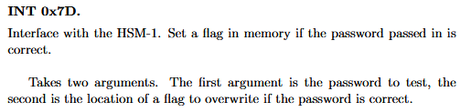

## Analyzing login

`main` is relatively simple in this challenge, so we immediately move into `login`.

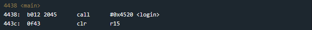

As I worked through this challenge, I realized it is probably easiest to explain by working backwards from the call to `unlock_door` rather than walking through all of `login`'s logic. Below, I highlighted the important instructions we need to dive into.

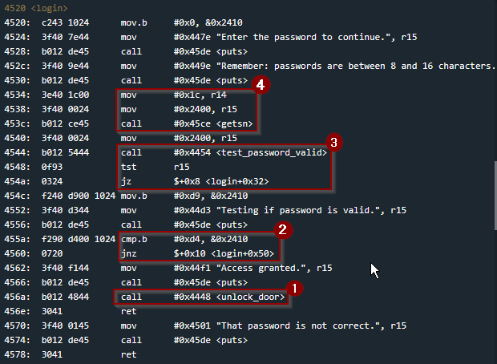

### unlock\_door

We know eventually we want to reach `0x4562` to print "Access Granted" and then subsequently call the `unlock_door` function. Inspecting this function, we see:

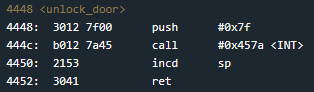

From the documentation on the LockitPro we know that the `0x7f INT` function will unlock the door. So we confirm we need to reach this function to pass the level.

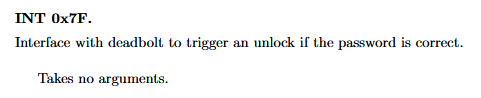

We need to reach `unlock_door`, but how can we? Well if the `cmp` instruction at `0x455a` sets the zero flag, we will reach it.

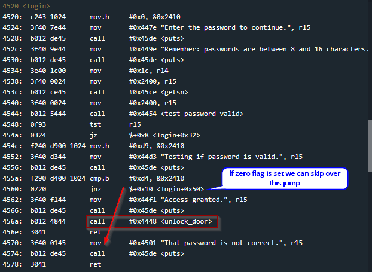

We need to set the `zero flag` to skip the `jnz`, but how can we?

### Never Trust, Always Verify

In order to set the `zero flag`, the byte at the absolute memory address `&0x2410` needs to contain `0xd4`.

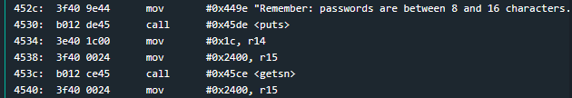

Looking all the way up to the call at `0x453c`to `getsn`, we observe `0x2400` is the destination address to write our password input. This means we need to place the hex value in `0x2410` which is `0x10` bytes after `0x2400`, making it the 17th byte (index 16).

But hold on, it says passwords can only be between 8 and 16 characters, right? We don't have enough room to fit the necessary 17th byte to pass the `cmp` check and skip over the jump.

If you look closely, the second argument passed to `getsn` through register `r14` is set to `0x1c`. This is equivalent to 16+12 = 28 in decimal.

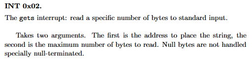

Recall from a previous post when we dived deeper into `getsn`, we found a call to `0x02 INT` whose documentation describes **its** second argument as the maximum number of bytes to read. Since 28 is provided in `r14`, we know we can input a password up to 28 bytes.

Even though the string claimed the password length was capped at 16, we can give more. Always validate user input lengths because you may be able to overwrite an important location if the programmer made a mistake. In this case, they certainly did.

### Overwriting Memory

We should be able to write directly to `0x2410`, the exact byte needed to pass the check. To verify, I set two breakpoints in `login` at `0x453c` and `0x4548`.

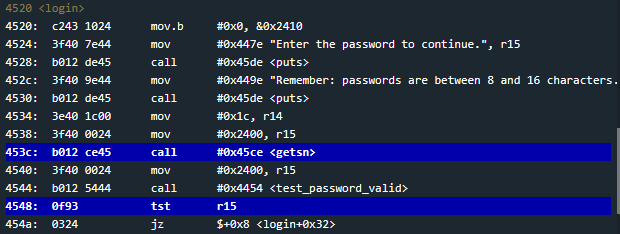

The first breakpoint allows us to step through the call to `getsn` and examine the live memory dump after our password has been written. I used "AAAAAAAAAAAAAAAAAAAAAAAAAAAA ..." which is easy to identify. Looking at the window, we can see we did indeed overwrite `0x2410`, which is the memory address where we need to place `0xD4` to reach `unlock_door`.

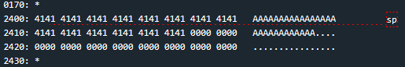

From here you can technically already solve the level without looking into `test_password_valid` but let's check it out anyway.

### test\_password\_valid

Essentially, this function updates a makeshift flag in memory after calling an offline HSM-1 to check if the password input was correct. The flag is referenced by `-0x4(r4)` and its value is moved into `r15` as we exit the function. This is important because in `login`, `r15` is compared to zero in the `tst` instruction at `0x4548`.

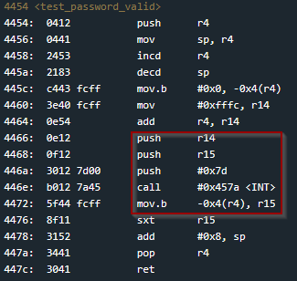

Presumably `r15` is set to 0 if the password was invalid, which causes the `jz` to be taken at `0x454a`. This jump is crucial because it skips the `mov` instruction which would overwrite our special byte at `0x2410`.

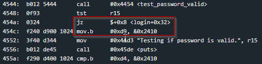

Interestingly, this seems to suggest that if the correct password was entered, the `test_password_valid` would place a non-zero value into `r15`, causing the `jz` to not be taken, `0x2410` to be overwritten with the value `0xd9`, and eventually the remaining `jnz` at `0x4560` would be taken, causing the lock to never unlock. But this doesn't affect us because the wrong password is setting `r15` to 0. So we can skip over this.

## Solution

Because we determined what byte needs to be written, where it needs to be written, and how to write it there, we can successfully solve the level. Below I show how it can be solved with multiple passwords ...

Working with `00 00 00 00 00 00 00 00 00 00 00 00 00 00 00 00 D4`

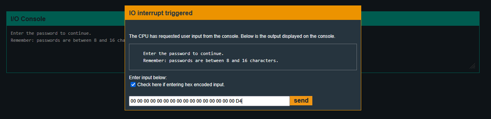

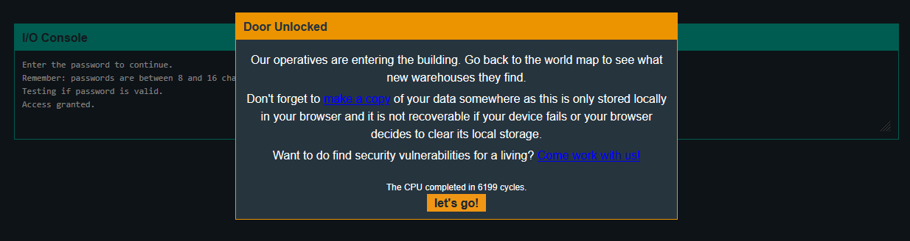

Working with `anything as long as D4 is the 17th byte`

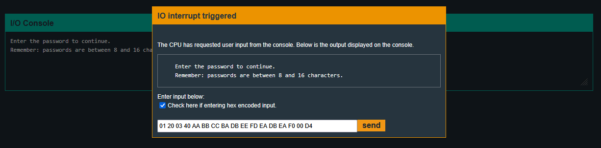

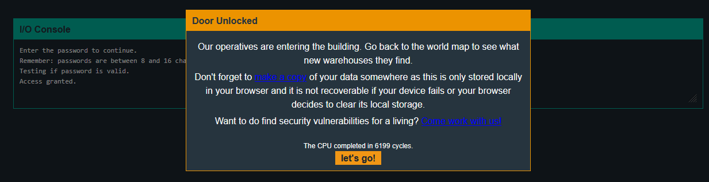

## Security Takeaway

Specifying maximum input lengths is an excellent practice that should be standard any time user input is handled by a program. However, this level shows that simply setting a maximum is not enough. The allowed input length must actually correspond to the size of the destination buffer. Otherwise, user input may still overwrite adjacent memory. In future challenges, we will see how a user can overwrite the saved return address and include their own malicious code to unlock the door. For now, overwriting a single byte was all that was needed.
