# Reykjavik

In this challenge, due to an encryption routine, we can no longer rely on our disassembly window to reverse the lock. In the real world, instructions are not always immediately available for static analysis. Code may first need to be unpacked, decoded, decrypted, or observed at runtime before we can determine what instructions are actually being executed. Relying solely on static reversing can become extremely tedious, and we must learn to recognize when we can allow the computer to do some of the work for us.

## (DIS)ASSEMBLER

So far in the CTF rooms, we have been relying on the disassembly window to read the instructions each lock program executes, and the debugger to watch the live memory dump and state of the registers. But what is a disassembly? A disassembler? What is the difference between assembly and disassembly?

Two excellent resources which explain these concepts are https://faq.computersciencewiki.org/index.php/home/article/understanding-opcodes-operands-and-control-signals-in-cpu-instruction-execution https://cs.lmu.edu/\~ray/notes/assemdisassem/

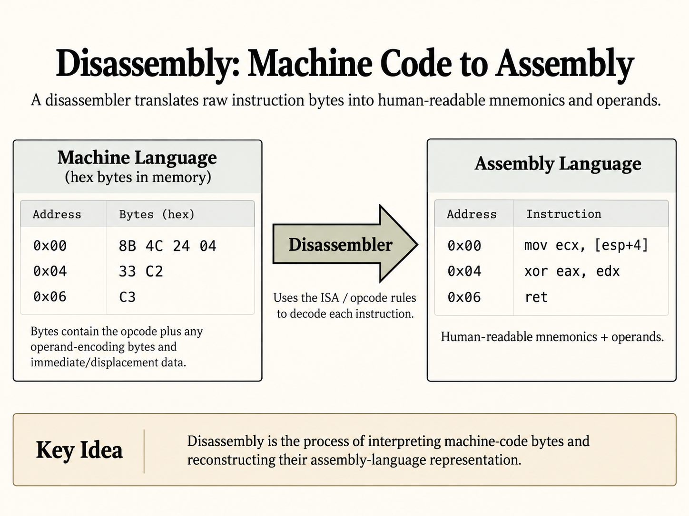

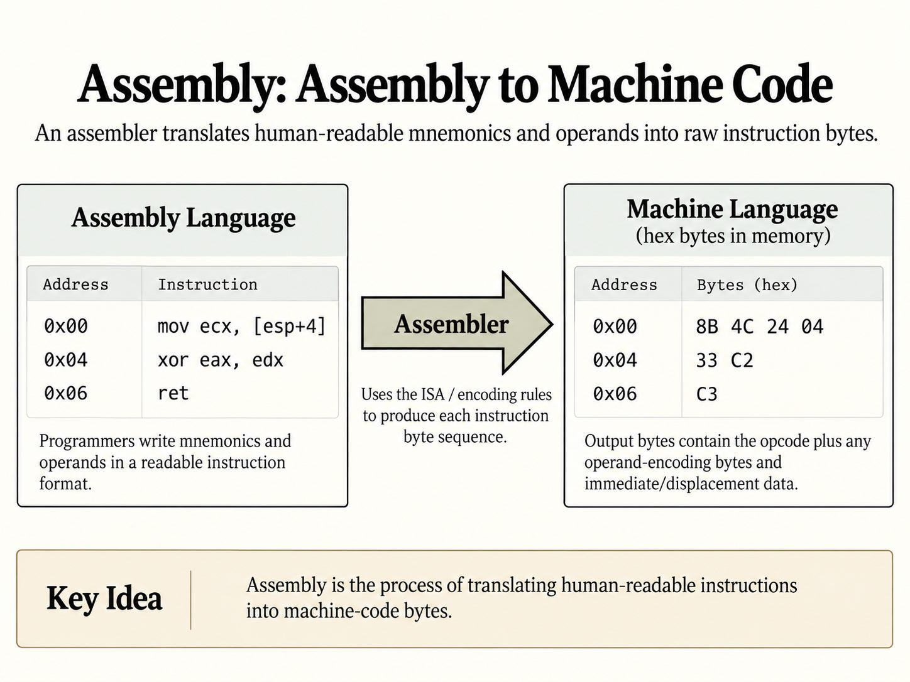

Luckily for us, `nccgroup` has provided a handy link https://microcorruption.com/assembler to both an assembler and disassembler for the `MSP430 microcontroller`.

Let's demonstrate using them before solving the level. Take the first instruction in `main`. It is located at `0x4438`. It is encoded as the machine-code words `3e40 2045`, which disassemble to `mov #0x4520, r14`.

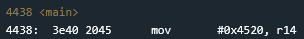

If we supply the machine-code bytes/words to the disassembler, it reconstructs the corresponding assembly instruction. We can then recognize the `mov` instruction in the resulting assembly.

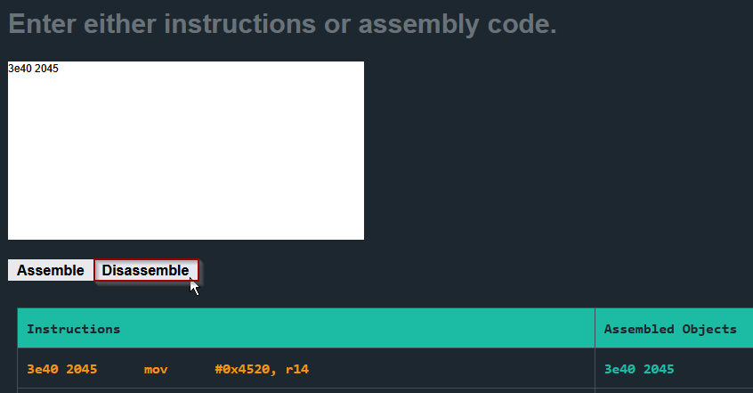

Likewise, say we know the assembly code we want to write but do not know its machine-code representation. We can use the assembler to generate it.

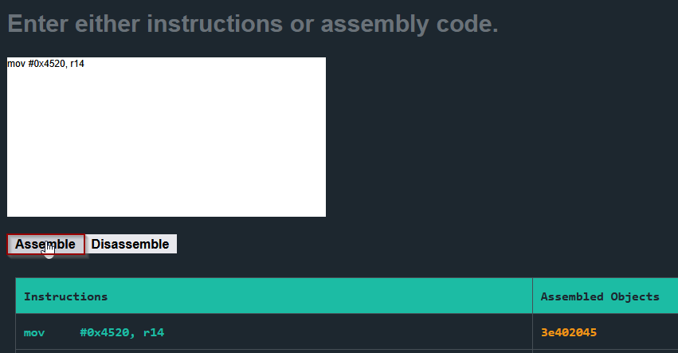

Both of these functionalities will be extremely important when it comes to reading decrypted instructions from memory, and building exploit payloads. With the background out of the way, let's dive in.

## Analyze `main`

In `main`, we find two function calls. The first calls the identified `enc` routine. The second calls address `0x2400`, which is not currently identified as a function in the static disassembly.

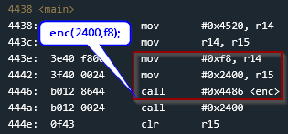

Interestingly, `0x2400` is provided to the `enc` function, and `main` calls `0x2400` immediately after `enc` returns. This suggests that `enc` might be decrypting instructions and writing them to `0x2400`, where they are then executed by `main`.

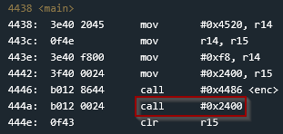

If we inspect the disassembly and live memory dump before `enc` executes, we do not find meaningful code at `0x2400`. It must be recovered at runtime.

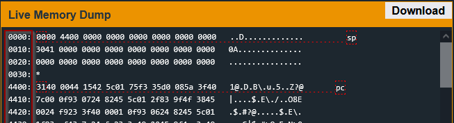

While looking through the disassembly, we can find a copy of the `INT` function, which we already know performs the functionality on the lock. This could be important later on, because it means reusable code that may be valuable later is already present in the binary.

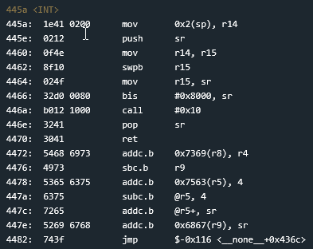

## Analyze `enc & 0x2400`

The `enc` routine is complex, and for now, it's not worth our time to statically analyze it if we can set a breakpoint and debug the program after the `enc` routine has completed.

```
4486 <enc>

4486:  0b12           push	r11
4488:  0a12           push	r10
448a:  0912           push	r9
448c:  0812           push	r8
448e:  0d43           clr	r13
4490:  cd4d 7c24      mov.b	r13, 0x247c(r13)
4494:  1d53           inc	r13
4496:  3d90 0001      cmp	#0x100, r13
449a:  fa23           jnz	$-0xa <enc+0xa>
449c:  3c40 7c24      mov	#0x247c, r12
44a0:  0d43           clr	r13
44a2:  0b4d           mov	r13, r11
44a4:  684c           mov.b	@r12, r8
44a6:  4a48           mov.b	r8, r10
44a8:  0d5a           add	r10, r13
44aa:  0a4b           mov	r11, r10
44ac:  3af0 0f00      and	#0xf, r10
44b0:  5a4a 7244      mov.b	0x4472(r10), r10
44b4:  8a11           sxt	r10
44b6:  0d5a           add	r10, r13
44b8:  3df0 ff00      and	#0xff, r13
44bc:  0a4d           mov	r13, r10
44be:  3a50 7c24      add	#0x247c, r10
44c2:  694a           mov.b	@r10, r9
44c4:  ca48 0000      mov.b	r8, 0x0(r10)
44c8:  cc49 0000      mov.b	r9, 0x0(r12)
44cc:  1b53           inc	r11
44ce:  1c53           inc	r12
44d0:  3b90 0001      cmp	#0x100, r11
44d4:  e723           jnz	$-0x30 <enc+0x1e>
44d6:  0b43           clr	r11
44d8:  0c4b           mov	r11, r12
44da:  183c           jmp	$+0x32 <enc+0x86>
44dc:  1c53           inc	r12
44de:  3cf0 ff00      and	#0xff, r12
44e2:  0a4c           mov	r12, r10
44e4:  3a50 7c24      add	#0x247c, r10
44e8:  684a           mov.b	@r10, r8
44ea:  4b58           add.b	r8, r11
44ec:  4b4b           mov.b	r11, r11
44ee:  0d4b           mov	r11, r13
44f0:  3d50 7c24      add	#0x247c, r13
44f4:  694d           mov.b	@r13, r9
44f6:  cd48 0000      mov.b	r8, 0x0(r13)
44fa:  ca49 0000      mov.b	r9, 0x0(r10)
44fe:  695d           add.b	@r13, r9
4500:  4d49           mov.b	r9, r13
4502:  dfed 7c24 0000  xor.b	0x247c(r13), 0x0(r15)
4508:  1f53           inc	r15
450a:  3e53           add	#-0x1, r14
450c:  0e93           tst	r14
450e:  e623           jnz	$-0x32 <enc+0x56>
4510:  3841           pop	r8
4512:  3941           pop	r9
4514:  3a41           pop	r10
4516:  3b41           pop	r11
4518:  3041           ret
```

After debugging the program and reaching our breakpoint, which is set right after the `enc` routine completes, we inspect the memory dump at `0x2400` and find data!

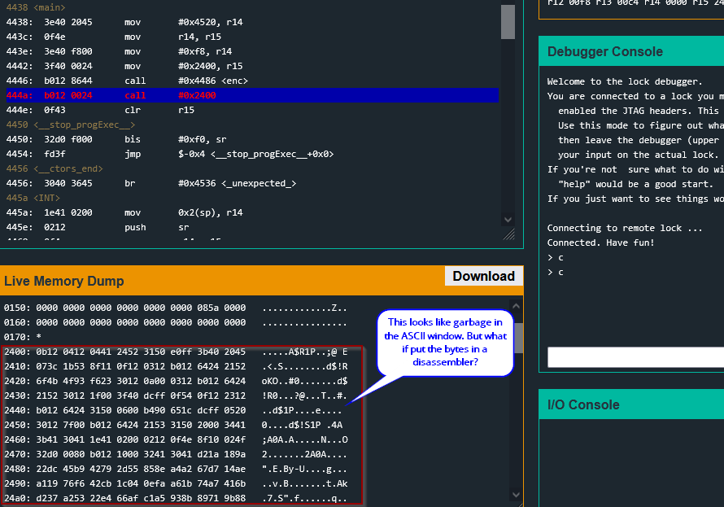

We can then take the data and attempt to disassemble it.

[Watch the disassembly walkthrough video](../../../.gitbook/assets/reykjavik-disassembly.mp4)

Analyzing this routine line by line would also be quite tedious. I’ll start by looking for calls, jumps, and instructions associated with conditional logic, such as `cmp` and `tst`.

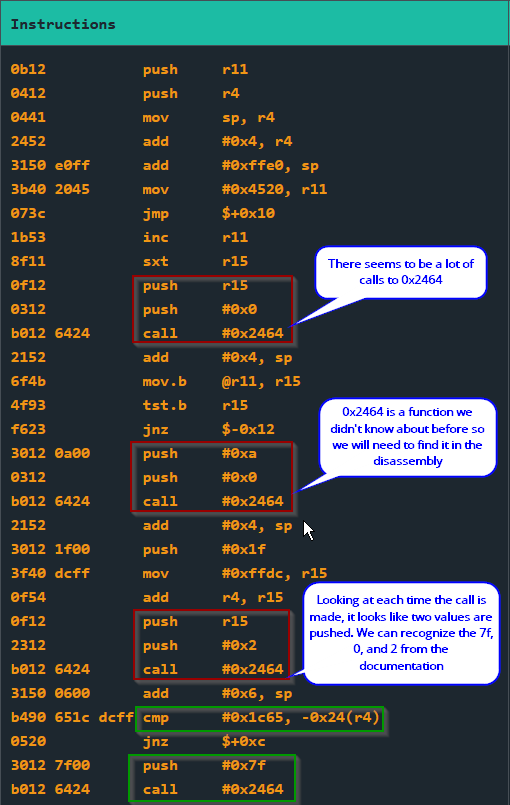

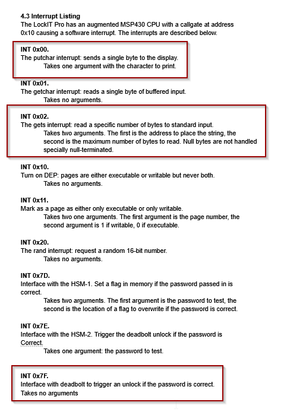

When examining the disassembly at `0x2464`, it turns out this is a copy of the `INT` routine we identified earlier. Comparing the two routines, we find them identical.

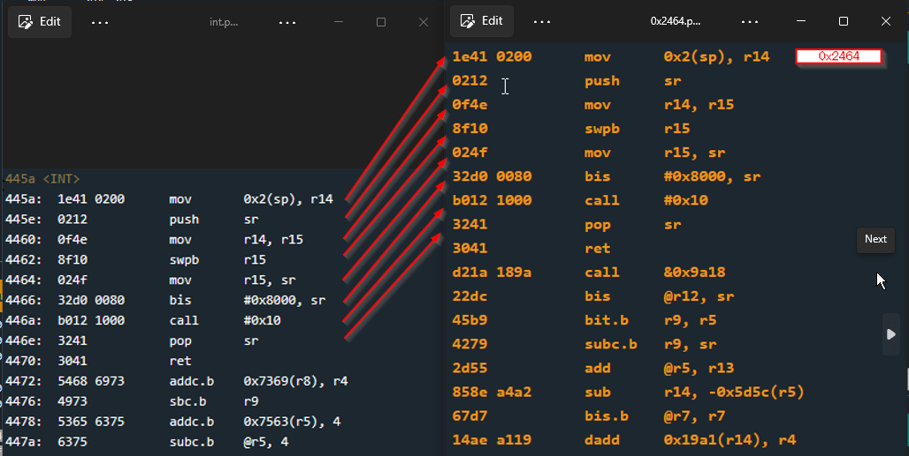

If we were using a tool like IDA Pro or Ghidra, we could label `0x2464` as `INT`, but for this web interface we will just have to remember it. With this identified, we know a `0x7f` call to `INT` unlocks the door. We can refer back to the disassembly to find a call that uses that value. We can also see a `cmp` followed by `jnz`. The `cmp` sets the Zero flag if the value at `-0x24(r4)` equals `0x1c65`. If they are equal, `Z` is set and the subsequent `jnz` is not taken, allowing execution to fall through to the `INT 0x7F` call.

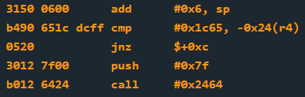

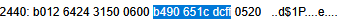

These instructions are located beginning at `0x2448`. The comparison expects the 16-bit word `0x1c65`. Because the MSP430 is little-endian, this value must appear in memory as the bytes `65 1c`.

## Finding r4

Let's set a breakpoint at `0x2448` and debug again to find the value in `r4`. This will help us identify what memory location's bytes are being compared with `0x1c65`.

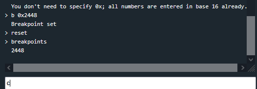

Before running the debugger, however, let's stop and think for a moment. We must find where `-0x24(r4)` is located to know where the bytes `65 1c` need to be written. But we also need to figure out where our password is being written to figure out if we can even write there.

We can trace the instructions looking for a `getsn` or we can also enter an identifiable test password like AAAAAAAAAAAAAAAAAAAAAAAAAAAAA and try to identify it in the memory window. For this small program, it's probably easier to do the second.

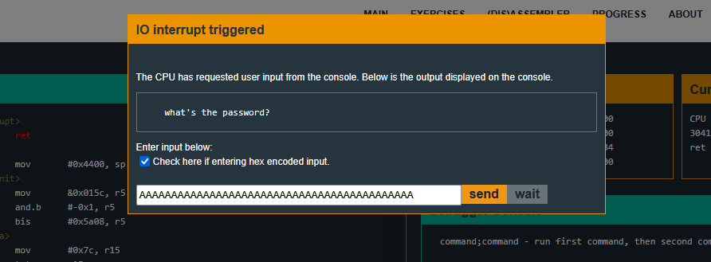

After reaching the breakpoint, we can see `r4` is set to `0x43fe` and our input is written nearby!

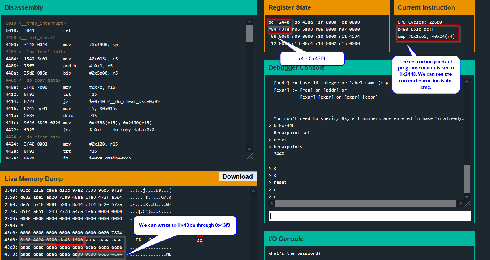

We use some hex math to check if we can write to `-0x24(r4)`.

`-0x24(r4)` is equivalent to `(r4)`- `0x24`, if we substitute `0x43fe` for `r4` and solve.

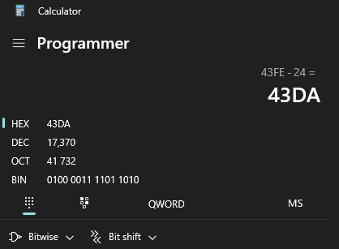

We know `0x43da` will be the location where `cmp` expects to find the word `0x1c65`. Because the MSP430 is little-endian, that word must be represented in memory as the bytes `65 1c`.

In the memory window we can confirm that we can write to `0x43da` by seeing our AAAA there.

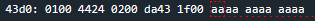

The first byte of our input is written to `0x43da`, so we can simply submit `651c` as our hex-encoded password to unlock the lock.

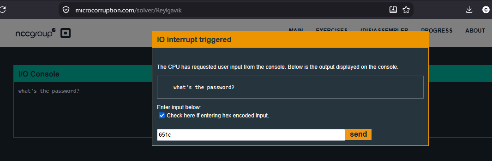

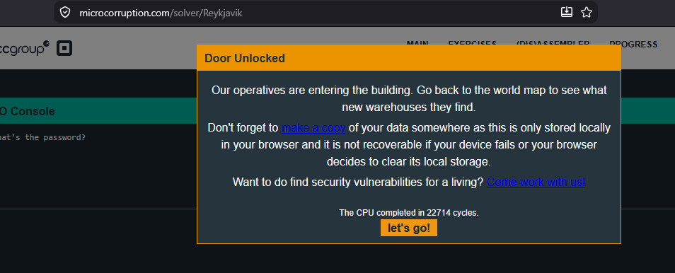

## Security Takeaway

Encryption and obfuscation can make static analysis more difficult, but they cannot prevent dynamic analysis. If encrypted code must eventually execute, it must first be decrypted into memory where a debugger can observe and analyze it. Reykjavik demonstrates why these techniques should be treated as barriers to analysis rather than substitutes for actual security controls.
