---
layout:
  width: default
  title:
    visible: true
  description:
    visible: true
  tableOfContents:
    visible: true
  outline:
    visible: true
  pagination:
    visible: true
  metadata:
    visible: true
  tags:
    visible: true
  actions:
    visible: false
---

# Sydney

An important detail to solve this level was explicitly written in **Section 1.8** of the `MSP430 Embedded Application Binary Interface` doc. The microcontroller is little-endian.

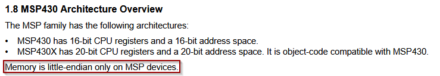

#### Endianness

[`geeksforgeeks`](https://www.geeksforgeeks.org/dsa/little-and-big-endian-mystery/) describes endianness as "the order in which bytes are arranged in memory."

* [ ] Big Endian - Stores the most significant byte first or the byte at the lowest memory address is the largest.
* [ ] Little Endian - Stores the least significant byte first or the byte at the lowest memory address is the smallest.

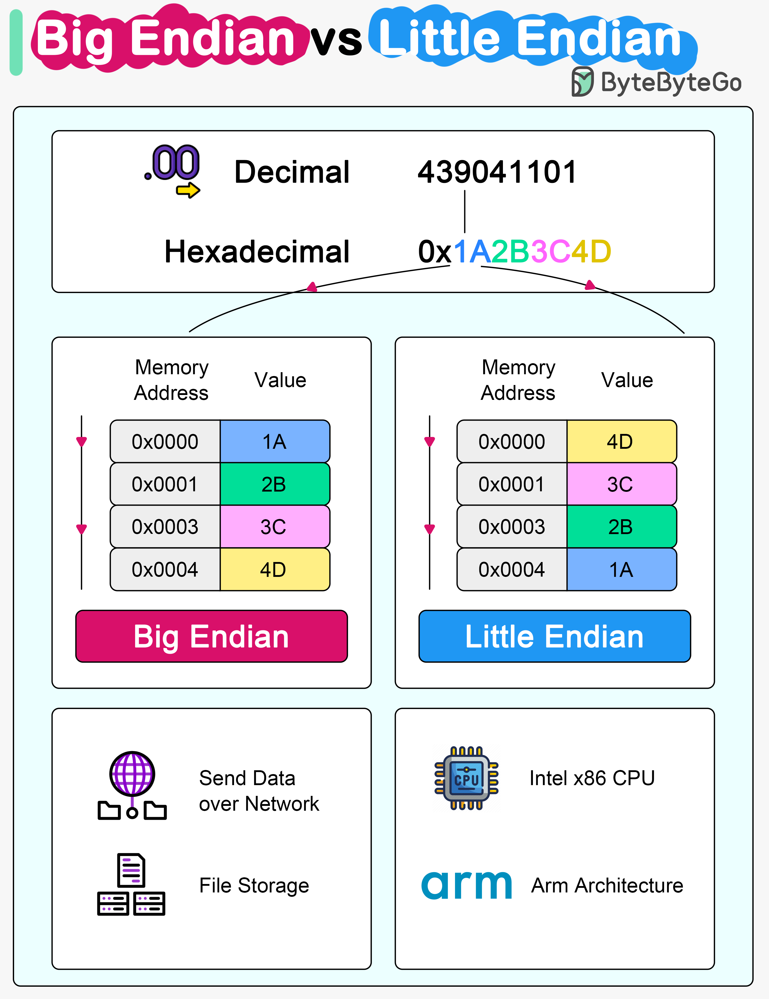

#### Analyzing Main

First I note how in comparison to the previous challenge `New Orleans` we are missing a create\_password function. We will have to dig deeper to find how to unlock this challenge.

While there are some differences, the `main` logic of `New Orleans` : Where `check_password` must return non-zero value to activate jump and skip over failure to the access granted logic at `main+0x26` or `0x445e`, is identical.

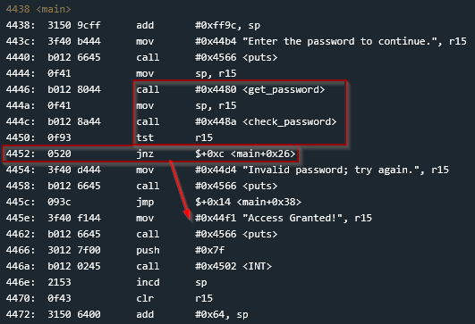

It looks to me like `check_password` is the next part I should investigate.

#### Analyzing check\_password

Immediately I notice 2 bytes of the password are each hard-coded into 4 `cmp` instructions. Together there are four separate checks on the input password, with each check only concerned with their 2 bytes.

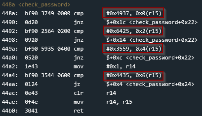

`r15` is used to hold an address and `0x00`, `0x02`, `0x04`, `0x06` are each used as indexes into the memory address in `r15`.

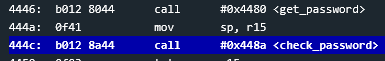

Looking back at `main`, we can see that `0x64` bytes were first reserved on the stack. The resulting stack pointer is then copied into `r15` before calling `get_password`, meaning `r15` points directly to this stack-allocated password buffer. After `get_password` returns, `main` copies `sp` into `r15` again before calling `check_password`, passing the same password buffer to the comparison function.

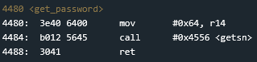

Further tracing the call into `getsn` we see one of the LockItPro's documented `INT` interrupt functions. Following the calling convention, we can see that `getsn` pushes the three arguments expected by `INT` onto the stack, `r14` being the maximum number of bytes to read, `r15` being the memory address to place the string, and `0x02` specifying the gets interrupt.

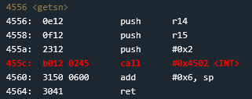

The interrupt eventually retrieves the password from user input, and we can see that the memory address held by `r15` is the value of the `stack pointer` after returning from the `get_password` function. Which after debugging the program we can tell is the address of the password input on the stack.

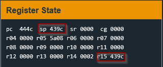

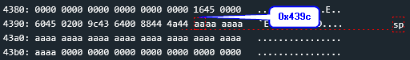

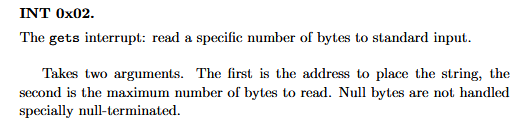

So from here we can confirm that `r15` is the address of the input password on the stack. And each of the compares at `0x448a` `0x4492` `0x449a` `0x44a4` will compare 2 bytes at a time of the password with the hard-coded values.

Since the MSP430 is little-endian, the least significant byte of each 16-bit word is stored at the lower memory address. Therefore, for a comparison against `0x4937`, the input buffer must contain the bytes `37 49`. Looking closely at the logic, we can see that after the first three comparisons have successfully passed, 1 is moved into `r14`. And then after the fourth check, the `jz` instruction will skip over the `clr` instruction which would reset `r14` back to 0.

From this analysis we can determine that all 4 `cmp` instructions need to pass.

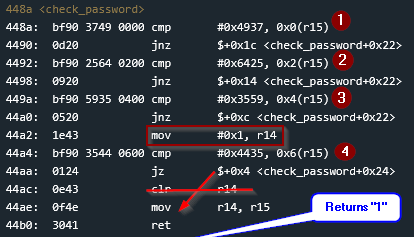

#### Recovering the Password

Walking through the first compare, we input the bytes with their endianness flipped when asked for the password input, and we can confirm in the `live memory dump` window. However it is not as simple as flipping the order from back to front. **Since the `cmp` instructions are only 2 bytes at a time, we need to reverse the byte order of each 2 byte increment in the password.**&#x20;

* `0x4937` becomes `0x3749`
* `0x6425` becomes `0x2564`
* ... etc

As we step through the comparison we see the `zero flag` is set after the `cmp` which will cause the `jnz` instruction to be skipped.

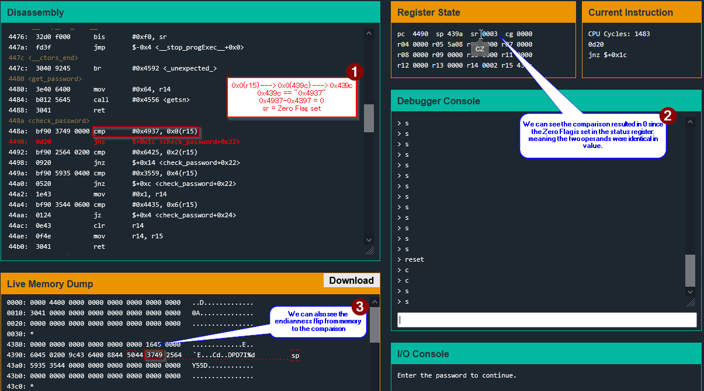

Likewise we step through each of the remaining `cmp` instructions, and after the third we see `r14` is set to 1, ready to pass the `tst` at `0x4450`.

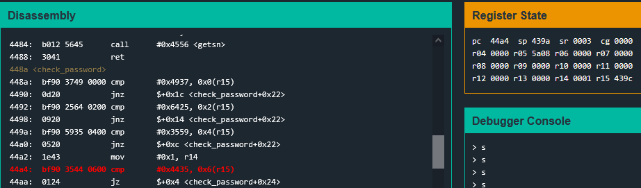

After debugging our answer and confirming it's success we solve the level.

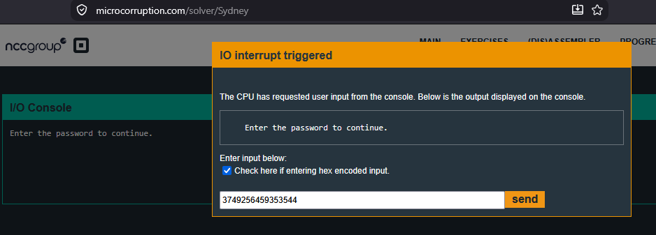

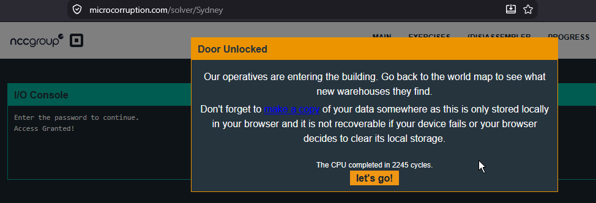

#### Security Takeaway

This challenge demonstrates why hard-coded passwords should not be relied upon to protect embedded devices. Even though the password is never stored as a readable string, analyzing the firmware reveals each value used by the comparison logic. Endianness and low-level implementation details may make the password less obvious, but they provide no meaningful protection against an attacker capable of reverse engineering the firmware.
