# Whitehorse

In this challenge we practice our skills in assembling machine-code in order to introduce custom instructions not present in the binary, building payloads with padding, and calculating the return address to point to our inserted code. These are foundational exploitation concepts. Modern mitigations such as DEP and ASLR make traditional stack-based code injection significantly more difficult, but understanding these techniques is necessary before studying more advanced protections such as CFI and shadow stacks.

Learn more here https://techcommunity.microsoft.com/blog/windowsosplatform/understanding-hardware-enforced-stack-protection/1247815

## Analyzing `main` & `login`

Main begins and ends with a call to `login`

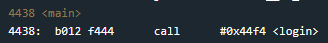

The `login` function has a few interesting calls.

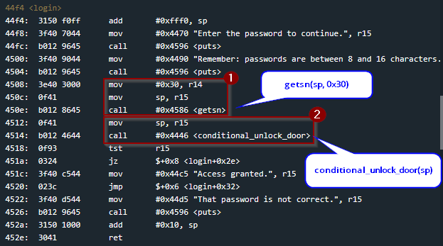

At `0x450e` the `getsn` function is called with two arguments, the destination address the string will be written to, and the length. Similar to previous rooms, the `puts` function suggests that the password input needs to be between 8 and 16 characters. But observing the call with a length of `0x30`, we see that we are able to write up to 48 bytes.

Combining this fact with the knowledge that the memory location being written to is the stack pointer, **we ought to keep an eye on this**.

The other interesting call is located at `0x4514`, which passes the password to `conditional_unlock_door`.

After `conditional_unlock_door` returns, `tst r15` sets the status flags based on the return value. The following `jz` branches to the failure path if `r15` is zero. Another thing I noticed was `login` seems to be missing any functionality to call `INT 7f` which unlocks the door, so it is likely occurring in `conditional_unlock_door`.

## Analyzing `conditional_unlock_door`

After looking through the instructions, we see it doesn't have a call `INT 7f` but it does have a call to `INT 7e`. There are also some operations involving registers `r4` and `r14` but they don't matter too much for the solution.

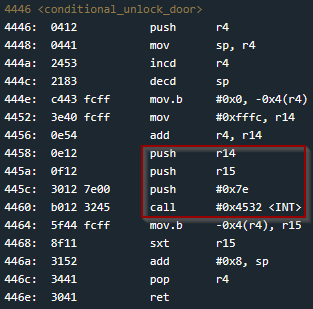

Checking the documentation we can see the call to `INT 7e` effectively exports the password verification logic to the HSM-2, making the password-validation implementation inaccessible to us for direct reverse engineering.

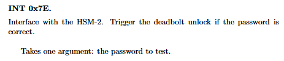

Without much else to go off of here, let's return to the oversized write, and check if we can smash a return address on the stack.

## Solution

I want to find out where my password input is being written so I set a breakpoint on `0x4514` just after the `getsn` call.

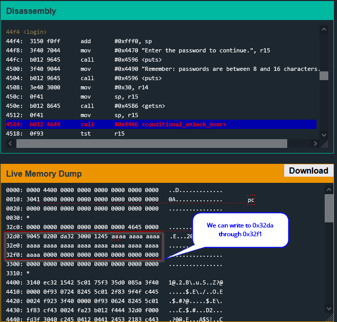

If we trace the stack pointer as the `login` routine reaches its `ret` instruction, we will see we can overwrite the return address.

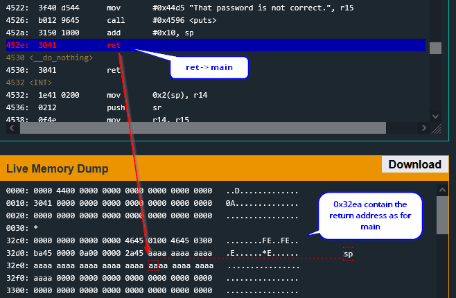

If we place an address at the saved return-address offset, `ret` will pop our supplied value into the program counter, redirecting execution to an address we control.

### Constructing the Unlock Stub

In previous levels, the binary already contained code that invoked interrupt `0x7f` to unlock the door but that instruction isn't in this program so we will have to write our own shellcode to achieve the same effect.

We can assemble the necessary instructions and operands to obtain the machine-code bytes that would perform a call `INT 7f` using the provided assembler.

First we find the address of the `INT` function at `0x4532`

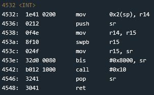

Then we write the asm instructions which would equate to an `INT 7f` invocation to unlock the door.

```asm
push	#0x7f
call    #0x4532
```

Finally we use the assembler, to generate the machine-code

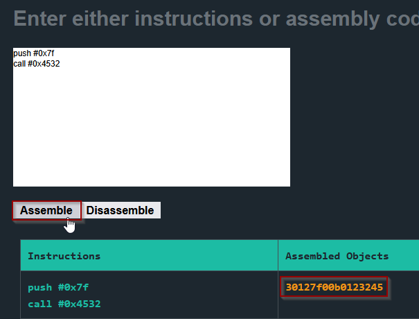

We can now place `3012 7f00 b012 3245` in our payload.

### Return Address and Payload Alignment

With the code now ready, we need to place it in our password input, and set the return address to point to it. We know the return address is located at `0x32ea` and we can write to it. So if we place our machine-code bytes right after it they will be located at `0x32ec`. We can then set `0x32ec` as the return address and when the `ret` instruction runs it will jump to our code and execute it.

Because the MSP430 uses little-endian byte ordering, the address `0x32ec` must appear in the input as the bytes `ec 32`. Therefore, `ec32` overwrites the saved return address with `0x32ec`

The payload would now look like this `ec32 3012 7f00 b012 3245`.

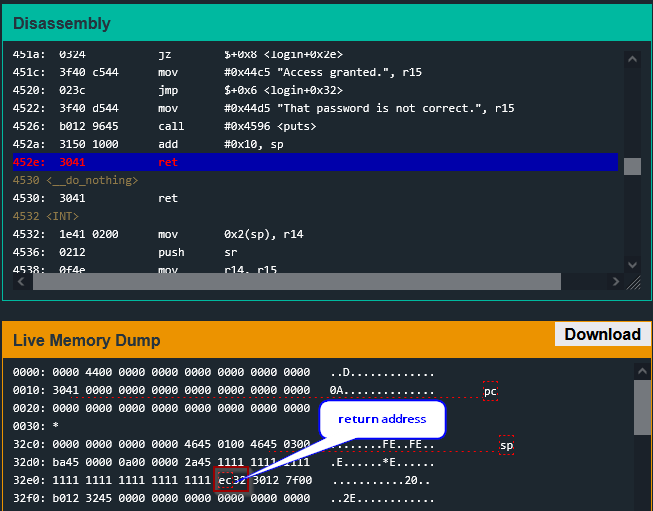

caption ^^ payload with ret highlighted

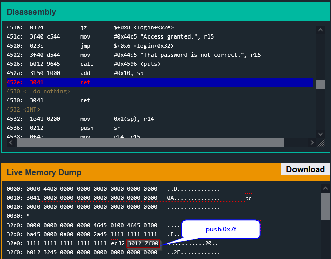

caption payload with push highlighted

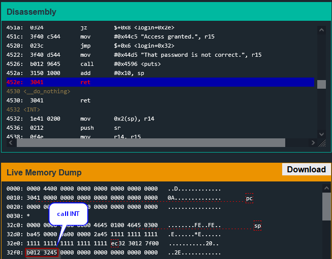

caption payload with call highlighted

But if we were to use just `ec32 3012 7f00 b012 3245` it would be offset incorrectly. We must pad the payload to align into the correct location. The input starts at `0x32da` as identified earlier, the saved return address is at `0x32ea`; therefore the offset is `0x10` bytes; and the injected instructions begin at `0x32ec`

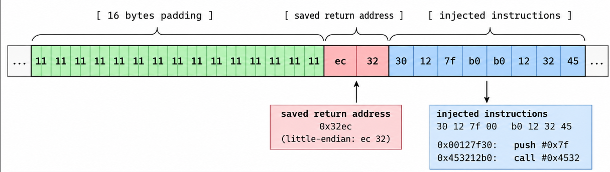

Inserting extra characters makes sure our payload is put in the correct location. You may have noticed in the previous screenshots I had already included padding in my payload for simplicity.

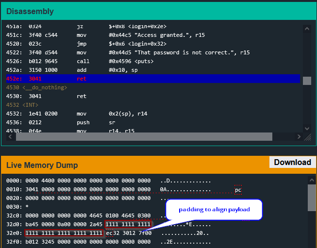

And testing the password shows we have successfully broken the lock.

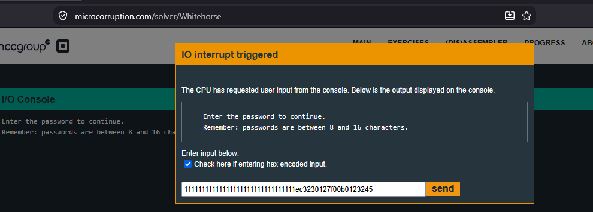

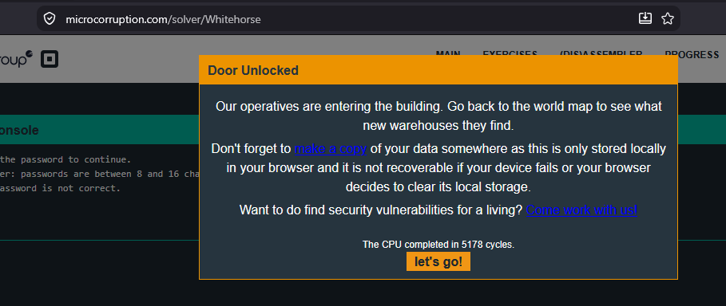

## Security Takeaway

Whitehorse demonstrates how a stack-based buffer overflow can progress from memory corruption to control-flow hijacking. Because `getsn` accepts more data than the stack buffer can safely hold, an attacker can overwrite the saved return address and redirect execution into attacker-controlled machine code placed on the stack.

Modern systems employ mitigations such as stack canaries, DEP/NX, ASLR, CFI, and hardware-backed shadow stacks to make this style of exploitation significantly more difficult. However, the underlying lesson remains the same: externally controlled input must never be allowed to exceed the bounds of its destination buffer.
